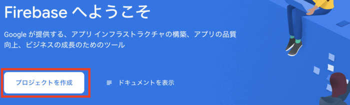
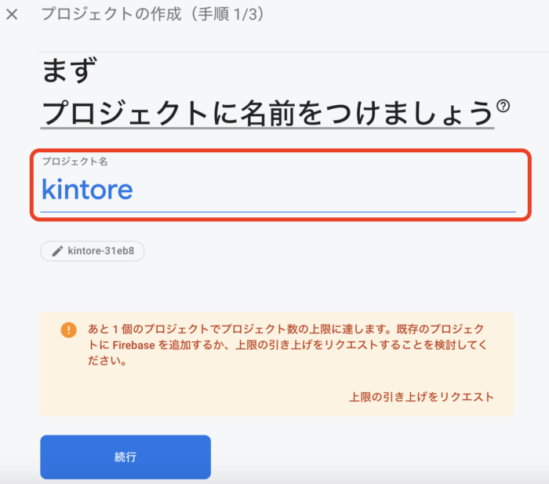
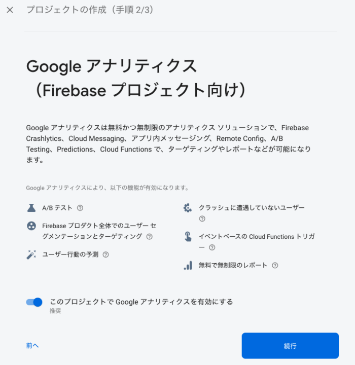
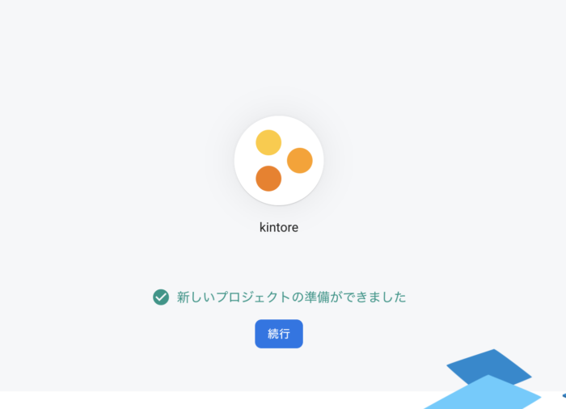
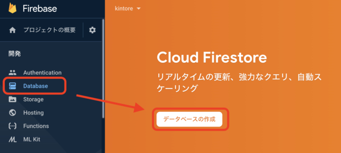
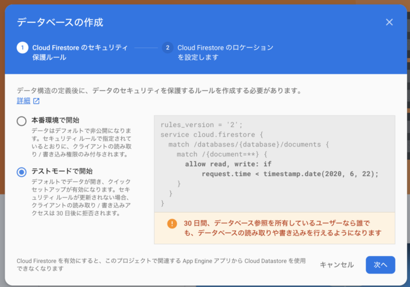
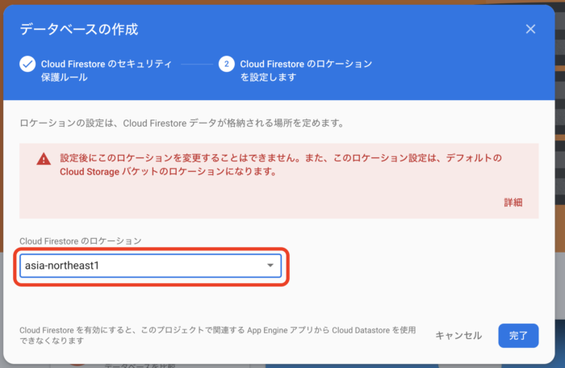
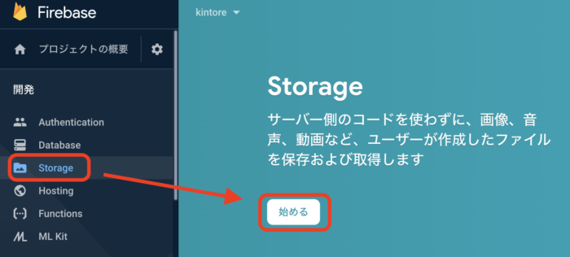
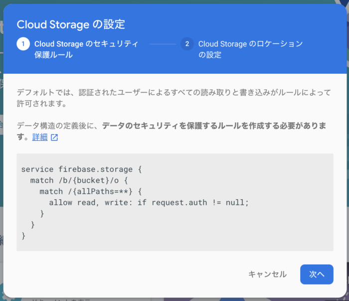
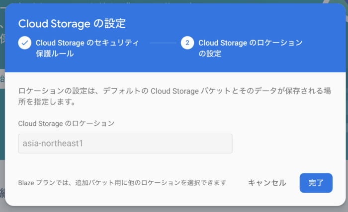

Nuxt.jsとmBaaSのFirebaseを連携させる。

# Firebaseの設定

Firebaseの最低限の初期設定を行なっていく。

## Firebaseでプロジェクトを作成する

Googleアカウントで、Firebaseにログイン。

Firebaseコンソール画面で「プロジェクトの作成」を選んで、プロジェクト名を入力する。





次に、Googleアナリティクスの設定。

こちらは好みに合わせて選べばよい。



続行を押して少し待ったら、次のような画面になり完了。



## Cloud Firestoreの初期設定

コンソール画面のメニューから「Database」を選択するし、「データベースの作成」をクリック。



ポップアップで、セキュリティルールの選択がでてくるので「テストモードで開始」を選択して「次へ」。



次のロケーションの設定では、**「asia-northeast1」**を選んで「完了」とする。

**設定後にロケーションの変更はできないので間違えないように注意する。**



これでCloud Firestoreの初期設定は終わり。

## Strageの初期設定

Strageは画像や動画ファイルを保存するところ。

コンソール画面のメニューの「Strage」を選択して「始める」をクリック。



ポップアップで、セキュリティルールの選択がでてくるので、そのまま「次へ」。



ロケーションの設定も「asia-northest1」がすでの選択されているので「完了」をクリック。



これで、Strageの初期設定は終わり。

# Nuxt.jsアプリをFirebaseに接続

次にNuxt.jsアプリをFirebaseに接続していく。

node.jsは、事前に自分の環境へインストールさせておくこと。

## Nuxt.jsアプリを作成

```
npx create-nuxt-app <App Name>
```

実行すると、色々と初期設定を聞かれていくので決めていく。

まず、プロジェクト名を聞かれるがこのままでいいのでEnter。

```
create-nuxt-app v2.15.0
✨  Generating Nuxt.js project in kintore
? Project name (kintore)
```

説明を聞かれるがそのままEnter。

```
? Project description (My shining Nuxt.js project)
```

作者名を聞かれるがそのままEnter。

```
? Author name (pop)
```

どのプログラミングを使うか聞かれるが、今回はJavaScriptを選択してEnter。

```
? Choose programming language (Use arrow keys)
❯ JavaScript
  TypeScript
```

パッケージマネージャーは、Npmを今回は選択。

```
? Choose the package manager
  Yarn
❯ Npm
```

UIフレームは好みで選んでよい。

今回はVuetify.jsを選んだ。

```
? Choose UI framework
  None
  Ant Design Vue
  Bootstrap Vue
  Buefy
  Bulma
  Element
  Framevuerk
  iView
  Tachyons
  Tailwind CSS
  Vuesax
❯ Vuetify.js
```

サーバーサイトのフレームは、今回使用しないのでNone。

```
? Choose custom server framework (Use arrow keys)
❯ None (Recommended)
  AdonisJs
  Express
  Fastify
  Feathers
  hapi
  Koa
  Micro
```

モジュールの選択では、使いたいものをスペースキーを押して選べばよい。

今回は何も使用しないので、そのままEnter。

```
? Choose Nuxt.js modules
 ◯ Axios
 ◯ Progressive Web App (PWA) Support
 ◯ DotEnv
```

Linterツールの選択は、使いたいものをスペースキーを押して選べばよい。

今回使用しないのでそのままEnter。

```
? Choose linting tools (Press <space> to select, <a> to toggle all, <i> to inver
t selection)
❯◯ ESLint
 ◯ Prettier
 ◯ Lint staged files
 ◯ StyleLint
```

次にテストフレームワークだが、今回は人気のJestを選択してEnter。

```
? Choose test framework
  None
❯ Jest
  AVA
```

モードの選択では、今回はSPAで作成したいので「Single Page App」を選択してEnter。

```
? Choose rendering mode
  Universal (SSR)
❯ Single Page App
```

VS codeの設定ファイルを作成するかを聞かれるが、VS codeをエディタとして使っているので、「jsconfig.json」を選択してEnter。

```
? Choose development tools
❯◉ jsconfig.json (Recommended for VS Code)
 ◯ Semantic Pull Requests
```

これで、最後に以下のように出ればNuxt.jsアプリのインストールが完了。

```
🎉  Successfully created project kintore

  To get started:

	cd kintore
	npm run dev

  To build & start for production:

	cd kintore
	npm run build
	npm run start

  To test:

	cd kintore
	npm run test
```

作成されたプロジェクトディレクトリに移動して、Nuxt.jsアプリが起動することを確認しておく。

```
cd <App Name>
npm run dev
```

## Nuxt.js側のFIrebase初期設定

Firebase CLIのインストールする。

Firebase CLIはFirebaseプロジェクトを使いやすく管理するためのツール。

今後も様々な場面でFirebaseを使うのでグローバルにインストールする。

```
npm install -g firebase-tools
```

作成しているFirebaseアカウントに接続する。

```
firebase login
```

Firebaseで作成したプロジェクトとローカルのNuxt.jsアプリを接続していく。

まず、Nuxt.jsアプリのプロジェクトディレクトリに移動して、以下のコマンドを実行。

```
firebase init
```

実行後、色々と設定を聞かれるので決めていく。

どのサービスを使うのか聞かれるので、使用するサービスに移動してスベースキーで選択していく。

今回はデータベースとホスティングを使いたいので、「Firestore」「Hosting」を選択してEnter。

```
? Which Firebase CLI features do you want to set up for this folder? Press Space
 to select features, then Enter to confirm your choices.
 ◯ Database: Deploy Firebase Realtime Database Rules
 ◉ Firestore: Deploy rules and create indexes for Firestore
 ◯ Functions: Configure and deploy Cloud Functions
❯◉ Hosting: Configure and deploy Firebase Hosting sites
 ◯ Storage: Deploy Cloud Storage security rules
 ◯ Emulators: Set up local emulators for Firebase features
```

次にFirebase上にあるどのプロジェクトを利用するか聞かれるので、事前に選択しておいたプロジェクトを選択する。

「Use an existing project」を選択してEnter。

```
? Please select an option: (Use arrow keys)
❯ Use an existing project
  Create a new project
  Add Firebase to an existing Google Cloud Platform project
  Don't set up a default projec
```

事前に作成したプロジェク名を選択してEnter。

```
? Select a default Firebase project for this directory: (Use arrow keys)
❯ kintore-31eb8 (kintore)
```

Firestoreのセキュリティルールの設定を聞かれるが、そのままEnter。

```
? What file should be used for Firestore Rules? (firestore.rules)
```

Firestoreのインデックスの設定を聞かれるが、そのままEnter。

```
? What file should be used for Firestore indexes? (firestore.indexes.json)
```

デプロイする際のディレクトリ名を設定するが、Nuxt.jsはビルドするとdistというファイルを作成してビルドするので、distと入力する。

```
? What do you want to use as your public directory? dist
```

SPAにするか聞かれるが、SPAとして作成するので、yと入力。

```
? Configure as a single-page app (rewrite all urls to /index.html)? (y/N) y
```

最後に以下のようにcomlete!と表示されれば設定は終わり。

```
✔  Firebase initialization complete!
```

プロジェクトディレクトリ配下に、以下のFirebase関連の設定ファイルが生成されていることを確認しておく。

```
.firebaserc
firebase.json
firestore.indexes.json
firestore.rules
dist/index.html
```

## Firebase接続情報をNuxt.jsに設定
