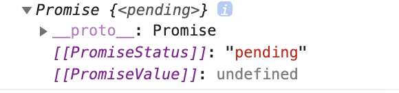

前回記事の[Promiseについて解説](https://blog.popweb.dev/programming/javascript/js-promise/)の続きで、今回はasync/awaitについて解説していく。

async/awaitを使うことで、前回に解説したPromiseの処理を同期的な記述で簡潔に書けるようになる。

## asyncとawaitと使う

Promiseインスタンスを返してくれるgetHello( )がある。前回のPromiseではこの関数にthenメソッドを繋いであげれば、非同期処理後の処理の記述ができた。

まず、このthenメソッドを同じ役割をしてくれるのがawaitである。

`await getHello( )`とすることでgetHello( )の非同期処理が終わるまで、その後に記述される処理を実行せずに待ってくれる。

非同期処理が完了すれば、`hello = await getHello('Start!')`としているので、Promiseでラップされた値が取り出され変数helloに代入される。

非同期処理が完了後、この後に記述される処理が順次実行されるという流れになる。

**awaitを内部で使っている関数には、先頭にasyncをつけるルール**になっているので忘れずにつけておく。

```
function getHello(msg) {
  return new Promise((resolve, reject) => {
    setTimeout(() => {
      console.log(msg)
      resolve("Hello,World!")
    }, 2000)
  })
}

async function func() {
  let hello
  hello = await getHello('Start!')
  console.log(hello)
  hello = await getHello('Start!')
  console.log(hello)
}

func()
```

上記のコード実行すると、2秒後ごとにコンソールへ文字が表示されることになる。

## 例外処理の方法

async/awaitの場合、try/catchブロックで例外処理を行う。

```
function getHello(msg) {
  return new Promise((resolve, reject) => {
    setTimeout(() => {
      console.log(msg)
      resolve("Hello,World!")
    }, 2000)
  })
}

async function func() {
  let hello
  try {
    hello = await getHello("Start!")
    console.log(hello)
  } catch (e) {
    throw new Error("Error!", e)
  }

  return hello
}

func().then(()=>{
console.log('ttt')
})
```

また、留意しておきたい点として、asyncの中でreturnされた値はPromiseでラップされた状態で返却されるということ。

上のコードで`console.log(func())`で確認すると、Promiseインスタンスが返ってきていることがわかる。

```
console.log(func()) // Promiseインスタンスが返ってきていることを確認
```



このように、thenメソッドを使っていた時より、分かりやすく非同期処理を書けるようになる。

async/awaitをつかうと、あたかも非同期処理を同期的に記述できるのがメリットである。
