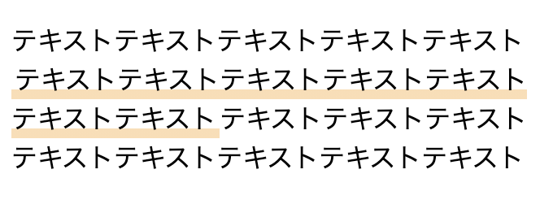

改行されているテキストにも対応できるCSSによるラインマーカーの作成。



以下、コード。

##### HTML

```
<p>
  テキストテキストテキストテキストテキスト<br />
  <span class="line-marker">テキストテキストテキストテキストテキスト<br />
    テキストテキスト</span>テキストテキストテキスト<br />
  テキストテキストテキストテキストテキスト
</p>
```

##### CSS

```
.line-marker {
	background: linear-gradient(transparent 70%, #FDDEB3 0%);
	display: inline;
	padding: 0 2px 4px;
}
```
