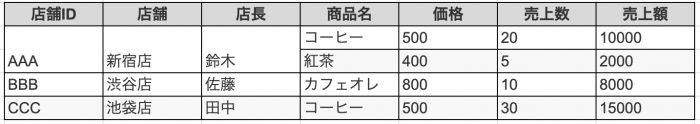
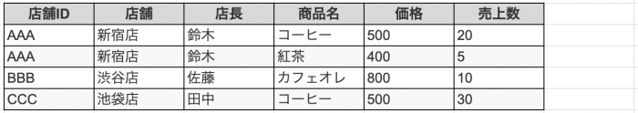
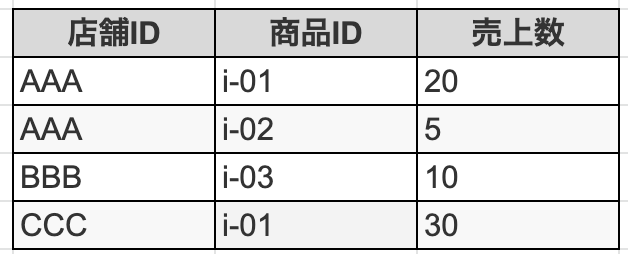
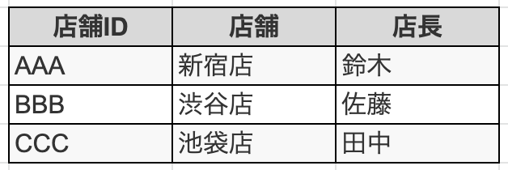
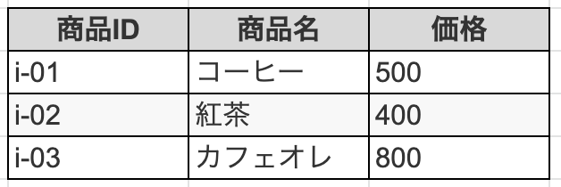
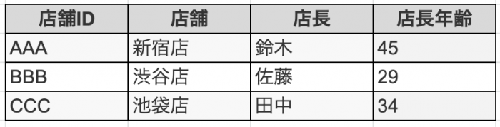
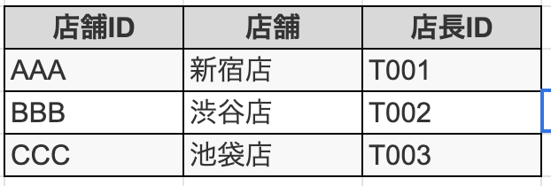
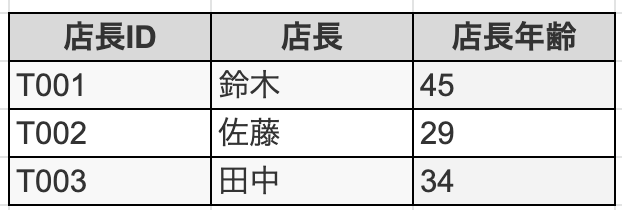

データベースには「正規化」するという作業がある。

正規化には第1正規化〜第5正規化までが存在しますが、リレーショナルデータベースを扱うなら、第1正規化〜第3正規化までできればよい。

# 正規化の手順

まず、正規化から説明する

1. **非正規形**
2. **第1世紀形**
3. **候補キーの選定**
4. **第2世紀形**
5. **第3世紀形**

今回は例として、都内で展開しているカフェ店を想定し、エクセル管理されているダミーデータを用意。

# 非正規形

非正規形とは、エクセルなどで見た目分かりやすくされた状態のこと。

例では、エクセルでセルが縦結合されて、行の中に複数行が存在している状態。

これの状態のことを「繰り返し項目が存在する」という。この状態を非正規形と呼ぶ。

# 第1正規形

第1正規形では、「繰り返し項目の排除」と「導出項目の排除」を行う。

例でいうと、新宿店の繰り返し項目が排除されて、すべてのレコード数が3つから4つになる。

また、導出項目の排除も行う。

導出項目は、他の項目の計算などによって導き出される項目のことで、例でいうと売り上げ金額になる。

# 候補キーの選定

候補キーとは、**テーブルの中で1つのレコードを特定できるカラムのこと、またはその組み合わせ。**

つまり、MySQLでいう主キーやユニークキーにあたる。

候補キーにならないものは、**非キー属性**と呼ぶ。

今回の例でいうと、候補キーは「店舗ID」と「商品名」になる。

大量なデータがあったとしても、この２つを抽出条件にすると、1つのレコードを特定できる。

# 第2正規形

第2正規形では、候補キーに対して、部分関数従属性のあるカラムを分離することを行う。

**「部分関数従属性」とは、候補キーの特定のカラムAが決まれば、他のカラムBがきまる関係性のこと。**

例では、「店舗ID」から決まるものは、「店舗」と「店長」。「商品名」から決まるものは「価格」

分離する時には、ついでに商品IDも付与する。

よって、以下のように「売上」「店舗」「商品」で分離できる。

- 売上テーブル

- 店舗テーブル

- 商品テーブル

# 第3正規形

第3正規形では、候補キーではない非キー属性に対して、推移的関数従属性のあるカラムを分離する。

**「推移的関数従属性」とは、非属性キーカラムAが決まれば、非属性キーカラムBが決まる関係性のこと。**

例えば、店舗テーブルで店長の年齢のカラムがあるとする。

店舗テーブルで、候補キーは「店舗」で、非属性キーは、「店長」と「店長年齢」。

「店長年齢」は、「店長」が決まれば分かる。

よって、以下のようにテーブルを分離できる。

- 店舗テーブル

- 店長テーブル

# まとめ

とりあえず、第1正規化〜第3正規化の説明は以上。
