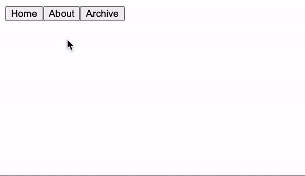

動的なコンポーネントについて説明する。

開発環境はは[Vue CLI](https://blog.pop-web.net/programming/vue-js/vue-cli-install/)を使っている前提で話を進めていく。

## 動的なコンポーネントの記述方法

動的にコンポーネントを切り替えるために、複数コンポーネントを用意しておく。

そして記述方法としては、`<component>`要素と`is`プロパティを以下のように設定する。

```
<component :is="currentComponent"></component>
```

`currentComponent`の変数名はなんでもいい、これにコンポーネント名を入れることで動的にコンポーネントを切り替えることができる。

例として、以下は3つのコンポーネントに切り替えるコード。

#### App.vue

```
<template>
  <div id="app">
    <button @click="currentComponent = 'Home'">Home</button>
    <button @click="currentComponent = 'Posts'">About</button>
    <button @click="currentComponent = 'Archive'">Archive</button>
    <component :is="currentComponent" />
  </div>
</template>

<script>
import Home from "./components/Home";
import Posts from "./components/Posts";
import Archive from "./components/Archive";

export default {
  components: {
    Home,
    Posts,
    Archive,
  },
  data() {
    return {
      currentComponent: "",
    };
  },
};
</script>
```

ブラウザで確認。



## kees-aliveでキャッシュする

動的コンポーネントを使用した場合、コンポーネントを切り替えるとコンポーネントは一度破棄される。

破棄せずにキャッシュしたい場合は、`<keep-alive>`でラップすれば良い。

```
<keep-alive>
  <component :is="currentComponent" />
</keep-alive>
```

また、`<keep-alive>`を使用した場合、ライフサイクルフックとして`activated`と`deactivated`が使える。

`activated`は、`<keep-alive>`内部のコンポーネントが表示された時に呼びだれて、`deactivated`は非表示になったときに呼び出される。
