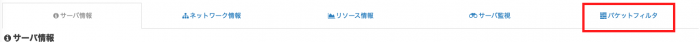
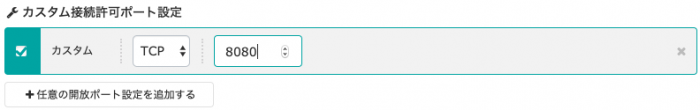
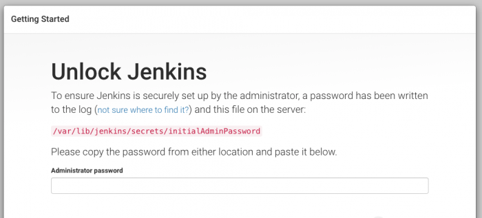

さくらのVPSでJenkinsのインストール手順を説明

前提として、Nginxがインストール済みであること。

Nginxのインストールついては、以前の記事で書いた。

https://blog.pop-web.net/server/linux/nginx-install/

## Jenkinsのインストール手順

さくらのVPSへSSH接続しておく。

### Javaのインストール

JekinsはJavaの実行環境が必要があるためインストールする。

```
sudo yum install java-1.8.0-openjdk
```

### Jenkinsのインストール

[公式サイトの手順](http://pkg.jenkins-ci.org/redhat-stable/)をそのまま

Jenkinsはyumでいきなりインストールすることができない。

そのため、yumリポジトリと公開鍵を追加する。

```
sudo wget -O /etc/yum.repos.d/jenkins.repo https://pkg.jenkins.io/redhat-stable/jenkins.repo
```

```
sudo rpm --import https://pkg.jenkins.io/redhat-stable/jenkins.io.key
```

上記が完了したら、以下コマンドでインストールができる

```
yum install jenkins
```

### Jenkinsの起動と自動起動の設定

Jenkinsの起動

```
sudo systemctl start jenkins
```

Jenkinsの自動起動の設定

```
sudo systemctl enable jenkins 
```

自動設定が有効になっているか確認。enabledになっていればOK。

```
sudo systemctl is-enabled jenkins
enabled
```

## 8080ポートを開ける

Jenkinsはデフォルトでは8080ポートが使用されるので、ファイアウォールの設定で8080ポートを開けておく

```
sudo firewall-cmd --add-port=8080/tcp --zone=public --permanent
```

firewalldを再リロード

```
sudo firewall-cmd --reload
```

以下で設定の確認

```
sudo firewall-cmd --list-all
```

ports: 8080/tcpの設定が確認できればOK。

以上でブラウザを起動し、契約IPの8080ポートへアクセスすれば、Jenkinsのスタートページが表示することができる。

```
 http://{契約しているIPアドレス}:8080/
```

しかし、これらの設定をしてもタイムアウトでアクセスできない場合がある。

さくらのVPSの場合、**パケットフィルタの設定で8080ポートへアクセスが拒否されており、Jenkinsスタートページへアクセスできない場合がある。**

そのため、さくらのVPSの管理画面でパケットフィルタの設定を行う。

## さくらのVPSのパケットフィルタの設定

さくらのVPSの管理画面でパケットフィルタのタブをクリック



次に「パケットフィルタの設定へ」をクリックして、設定画面へ。

「任意の開放ポート設定を追加する」をクリックして8080ポートの接続を許可する。



## ブラウザでスタートページを確認する

ブラウザを起動後、契約IPの8080ポートへアクセスし、Jenkinsのスタートページが確認できればOK。

```
 http://{契約しているIPアドレス}:8080/
```


