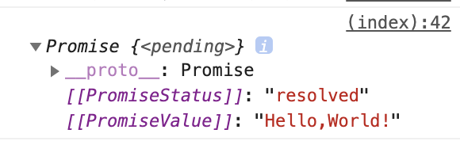
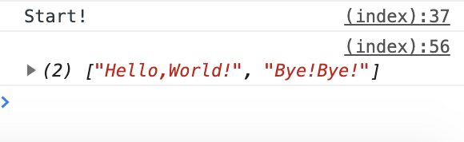

前回の[「コールバック関数について解説」](https://blog.popweb.dev/programming/javascript/js-callback/)の続き。

非同期処理の際にコールバック関数を使うのは有効であるが、コールバック地獄に陥りやすいデメリットがある。

コールバック地獄対策として非同期処理を簡潔に書けるようにしたのが、**Promise**である。

## Promiseについて

Promiseについて簡単にいうと、**非同期処理の処理状態を示してくれるやつ**だ。

非同期処理においてポイントなることは、**非同期処理が終わった後のタイミングで、違う処理を処理をしたいということ。**

そうなると、非同期処理の状態が完了しているのか？まだ終わってなのか？が知る必要がある。

そこで、Promiseの登場。

Promiseの引数に非同期処理を入れてやり、その戻り値を取得することでで状態を判別できる。

## Promiseの使い方

Promiseの使い方は、return new Promise( )の引数としてコールバック関数を入れる。

このコールバック関数に、非同期処理の内容を記述する。

以下の例では、setTimeout( )関数を使って非同期処理を記述した。

```
function getHello(msg) {
  return new Promise((resolve, reject) => {
    setTimeout(() => {
      console.log(msg)
      resolve("Hello,World!")
    }, 2000)
  })
}

getHello('Start!').then(msg => {
  return getHello(msg)
})
```

まず、関数であるgetHello( )を実行すると戻り値（return）としてPromiseクラスのインスタンスが返ってくる。

**このPromiseインスタンスに、非同期処理の処理状態の情報が入っている。**

console.log(getHello( ))で確認すると、確かにPromiseが返ってきていることがわかる。

```
console.log(getHello()) // Promiseインスタンスが返ってきていることを確認
```



Promiseのコールバック関数の第一引数としてresolve、第二引数としてrejectを設定することができ、**処理が成功した時はresolve、失敗した時はrejectが呼び出される。**

コールバック関数の処理の最後に**resolve又は、rejectメソッドを呼び出すことで処理の終了を明示的に表す。**

次に、Promiseクラスのインスタンスはthenメソッドを持っており、引数にコールバック関数を入れてあげる。

thenメソッドの第一引数には、resolve又は、rejectメソッドで渡された値が入る。

つまり、Promiseで処理した後の値をthenメソッドに渡して処理をさせるということができる。

また、thenメソッドの中でreturnで再度Promiseインスタンスを返すことで、非同期処理を実行することができる。

上のコードでは、resolveメソッドで処理が終了して、thenメソッドで渡された値が処理されるという流れになり、2秒後に「Start!」、またその2秒後に「Hello,World!」と表示される。

ポイントとしては、**thenメソッドで値をPromiseインスタンスをreturnさせると、また次のthenメソッドのコールバック関数の第一引数として受け取ることができる。**

上で使ったコードを書き直す。

以下、getByebye( )という関数を追加して、thenメソッドを以下の方に追加して繋げる。

```
function getHello(msg) {
  return new Promise((resolve, reject) => {
    setTimeout(() => {
      console.log(msg)
      resolve("Hello,World!")
    }, 2000)
  })
}

function getByebye() {
  return new Promise((resolve, reject) => {
    setTimeout(() => {
      resolve("Bye!Bye!")
    }, 3000)
  })
}

getHello('Start!').then(msg => {
  return getHello(msg)
}).then(() => {
  return getByebye()
}).then(msg => {
  console.log(msg)
})
```

このコードを実行すると、2秒後に「Start!」、またその2秒後に「Hello,World!」と表示され、さらにその3秒後に「Bye!Bye!」と表示される。

以下のように、thenメソッドの引数としてgetByebyeをそのまま渡してあげても同じになる。

```
getHello('Start!').then(msg => {
  return getHello(msg)
}).then(getByebye)
.then(msg => {
  console.log(msg)
})
```

## エラー処理のrejectについて

Promiseの第二引数であるrejectはエラー処理を扱うもので、値をcatchメソッドで受け取る。

さっきほどのgetHello関数のresolveで返却していたところをrejectに変更する。

```
function getHello(msg) {
  return new Promise((resolve, reject) => {
    setTimeout(() => {
      console.log(msg)
      reject("Error!")
    }, 2000)
  })
}

function getByebye() {
  return new Promise((resolve, reject) => {
    setTimeout(() => {
      resolve("Bye!Bye!")
    }, 3000)
  })
}

getHello('Start!').then(msg => {
  return getHello(msg)
}).then(() => {
  return getByebye()
}).then(msg => {
  console.log(msg)
}).catch(error => {
  console.log(error)
})
```

これを実行すると、getHello関数以降の処理が飛ばされて、「Error!」という表示される。

## Promise.allで配列で処理

Promise.allメッドを使うことで関数を配列として渡し、並列処理することができる。

以下のよう、返却される値はresolveの値が配列として返ってくる。

```
function getHello(msg) {
  return new Promise((resolve, reject) => {
    setTimeout(() => {
      console.log(msg)
      resolve("Hello,World!")
    }, 2000)
  })
}

function getByebye() {
  return new Promise((resolve, reject) => {
    setTimeout(() => {
      resolve("Bye!Bye!")
    }, 5000)
  })
}

Promise.all([
    getHello('Start!'),
    getByebye()
  ])
  .then((msgs) => {
    console.log(msgs)
  })
```

上記のコードを実行すると、2秒と5秒で秒数は異なるが、すべてが完了するまでthenメソッドは実行されない。

以下のように、5秒後にresolveの値がすべて入った配列が返される。



## 省略して書くことも可能

Promiseの以下のコードは省略して書くことも可能。

```
function getHello() {
    return new Promise((resolve, reject) => {
        resolve("Hello,World!")
    })
}
```

省略形は以下のよう。

```
function getHello() {
    return Promise.resolve("Hello,World!")
}
```

次の記事では、Promiseを同期処理ように書くことができる**async/await**について解説していく。

**async/await**については下記↓

https://blog.popweb.dev/programming/javascript/async-await/
