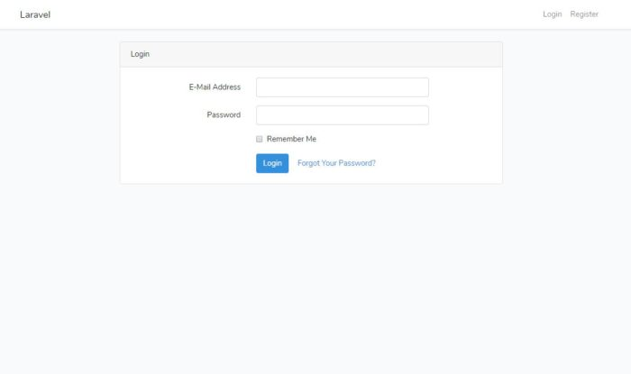

Laravelの認証機能をつかって、よくあるログイン機能を作っていきます。

## Laravelインストール

適当なプロジェクト名でLaravelをインストールします。

```
composer create-project --prefer-dist laravel/laravel laravel_login
```

## データベースの設定

データベースは、MySQLを使用します。

.envファイルを開いて以下ののように、データベース名、ユーザー名、パスワードを設定ます。

```
DB_DATABASE=login_db
DB_USERNAME=root
DB_PASSWORD=
```

## データベースの作成

データベースの設定で記述したデータベース名でデータベースを作成します。

### MySQLにログインします。

```
>mysql -u root
```

mysqlコマンドが使えない場合は、Pathを追加する必要があります。  
[XAMPPでMySQLコマンドを使えるようにする方法【Windows10】](https://blog.pop-web.net/programming/xampp-mysql-command/)

### データベース作成

```
mysql> create database login_db;
```

作成されたか確認しておきます。

```
mysql> show databases;
```

できたら一旦、MySQLを終了しておきます。

```
mysql> exit;
```

## マイグレーションを実行する

```
>php artisan migrate
Migration table created successfully.
Migrating: 2014_10_12_000000_create_users_table
Migrated:  2014_10_12_000000_create_users_table
Migrating: 2014_10_12_100000_create_password_resets_table
Migrated:  2014_10_12_100000_create_password_resets_table
```

## 認証機能を作るartisanコマンドを実行する

```
>php artisan make:auth
Authentication scaffolding generated successfully.
```

これでなんと、認証機能に最低限必要なファイルは生成されていまうんです。

以下の3つの機能が実装されています。

- **ログイン**
- **登録**
- **パスワードリセット**

ブラウザで確認します。

「/home」へアクセスしてください。



こんな感じで、ログインフォームやら、登録機能やらができあがっています。

## 動作確認

「登録」や「ログイン」、「パスワードリセット」を実際に動作するか確認しておきます。
