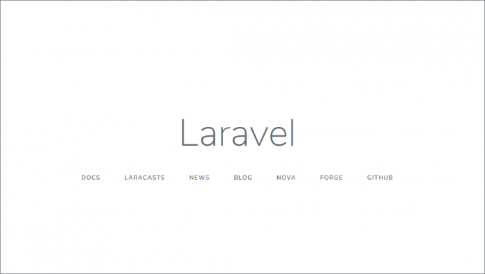
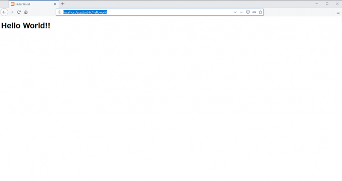

事前に**XAMPP**と**Laravel**と**Composer**をインストールしておいてください。

Laravelのインストールは[Laravelのインストール方法、方法は2パターン【Windows10】](https://blog.popweb.dev/programming/laravel/laravel-install/)を参考にしてみてください。

## プロジェクトフォルダの作成

まずは、作業するためのフォルダを作成します。

コマンドプロンプトを起動して、XAMPPの「htdocs」フォルダに移動

```
cd C:\xampp\htdocs
```

## Laravelコマンドの実行

「laravel new プロジェクトの名前」で、コマンドを実行します。

今回、 プロジェクトの名前は「app」で作成。

```
composer global require "laravel/installer" --prefer-dist
laravel new app
```

または、こっちでインストール

```
composer create-project --prefer-dist laravel/laravel app
```

コマンドを実行すると、色々とインストールされるので完了するまで待ちます。

## URLにアクセスしてページ確認

以下の、URLにアクセスすればLaravelのデフォルトページが確認できます。

[http://localhost/app/public/](http://localhost/app/public/)



## PHPテンプレートファイルの作成

appフォルダの中の「resources」->「view」に移動して、「helloworld」を作成し、さらにその中に「index.php」という名前でPHPファイルを作成します。

ソースをは以下を記述します。

```
<!DOCTYPE html>
<html lang="ja">
<head>
    <meta charset="UTF-8">
    <title>Hello World</title>
</head>
<body>
    <h1>Hello World!!</h1>
</body>
</html>
```

## ルートの設定でテンプレートを表示

作成したテンプレートを表示させるため、ルート情報を設定します。

「routes」->「web.php」を開きます。

「web.php」に、以下のソースを追記します。

```
Route::get('hello', function () {
    return view('helloworld.index');
});
```

保存したら、以下のURLにアクセスして表示確認します。

[http://localhost/app/public/helloworld](http://localhost/app/public/helloworld)

きちんと、「Hello World!!」が表示されれば完了です。


