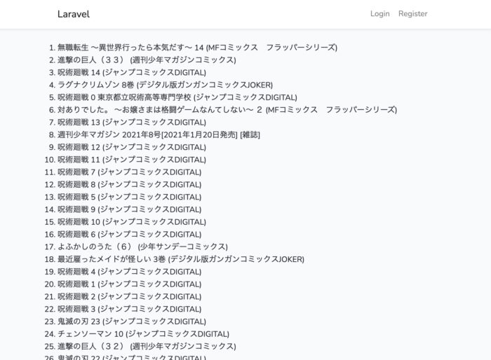
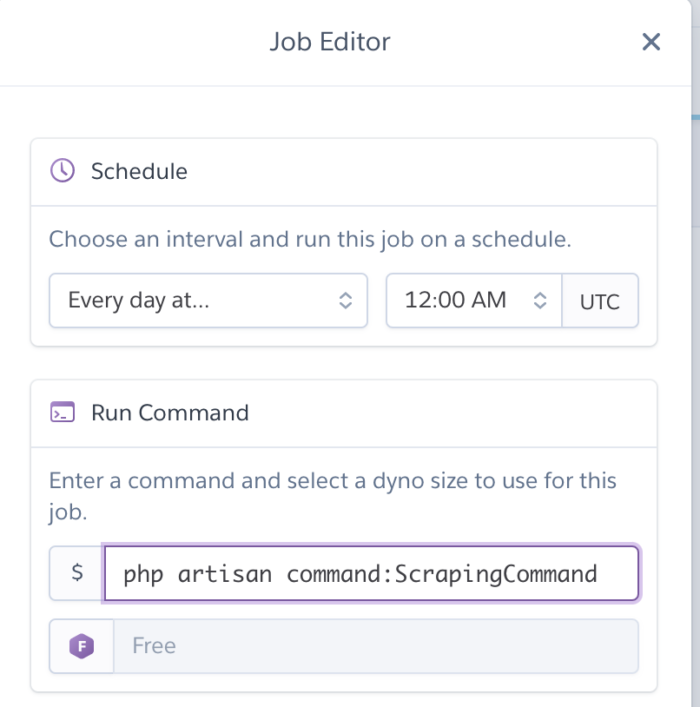

まず、LaravelでWebスクレイピングするため、ライブラリである「[FriendsOfPHP/Goutte](https://github.com/FriendsOfPHP/Goutte)」をインストールする。

LaravelのバージョンはLaravel6.20。

## インストール

```
$ composer require fabpot/goutte
```

以前のLaravelのバージョンではconfigファイルを設定する必要があるが、Laravel5.5以降はAutoDiscoveryがあるのでそのまま使える。

## 実装

まず、controllerを作成する。

```
$ php artisan make:controller ScrapingController
```

### controllerに処理を書く

今回は漫画書籍ランキングからタイトルだけ取得してみる。

```
<?php

namespace App\Http\Controllers;

use Goutte\Client;

class ScrapingController extends Controller
{
    public function scraping()
    {
        $client = new Client();
        $crawler = $client->request('GET', 'https://www.amazon.co.jp/gp/bestsellers/digital-text/2430812051/ref=pd_zg_hrsr_digital-text');
        $titles = $crawler->filter('li.zg-item-immersion')->each(function ($li) {
            $title = $li->filter('div.p13n-sc-truncate-desktop-type2')->text();
            return $title;
        });
        return view('scraping', compact('titles'));
    }
}
```

基本的には、`use Goutte\Client;`して`new Client();`でインスタンスを作ると色々メソッドが使えるようになる。

使い方は、[FriendsOfPHP/Goutte](https://github.com/FriendsOfPHP/Goutte)や[DomCrawler](https://symfony.com/doc/current/components/dom_crawler.html)が参考になると思う。

### viewを作る

次に取得したタイトルを表示するviewをつくる。

```
@extends('layouts.app')

@section('content')
    <ol class="container">
        @foreach($titles as $title)
            <li>{{ $title }}</li>
        @endforeach
    </ol>
@endsection
```

### ルーティングの設定

```
Route::get('/scraping', 'ScrapingController@scraping')->name('scraping');
```

### 表示の確認

ブラウザで表示確認してみる。



## 定期実行のやり方

定期実行されるには、まずコマンドラインで実行させるためコマンドクラスを作成する。

```
$ php artisan make:command ScrapingCommand
```

### コマンドクラスに処理を書く

`app/Console/Commands/ScrapeCommand.php`が作成されているので、これを編集。

```
<?php

namespace App\Console\Commands;

// useでGoutte\Clientをインポート
use Goutte\Client;
use Illuminate\Console\Command;

class ScrapingCommand extends Command
{
    /**
     * The name and signature of the console command.
     *
     * @var string
     */
    // コマンド名を変更
    protected $signature = 'command:ScrapingCommand';

    /**
     * The console command description.
     *
     * @var string
     */
    // コマンドの説明を変更
    protected $description = 'スクレイピングコマンド';

    /**
     * Create a new command instance.
     *
     * @return void
     */
    public function __construct()
    {
        parent::__construct();
    }

    /**
     * Execute the console command.
     *
     * @return mixed
     */
    public function handle()
    {
        //　スクレイピング処理を書く
        $client = new Client();
        $crawler = $client->request('GET', 'https://www.amazon.co.jp/gp/bestsellers/digital-text/2430812051/ref=pd_zg_hrsr_digital-text');
        $titles = $crawler->filter('li.zg-item-immersion')->each(function ($li) {
            $title = $li->filter('div.p13n-sc-truncate-desktop-type2')->text();
            return $title;
        });
        dd($titles);
    }
}
```

### コマンドを実行してみる

```
$ php artisan command:ScrapingCommand
```

コマンド実行後、コマンドラインから取得が確認できたらOK。

### データベース保存

データベースに保存する処理を追加。

モデルとマイグレーションファイルを作成しておく。

```
$ php artisan make:model Item -m
```

作成されたマイグレーションファイルを編集

```
<?php

//...

    /**
     * Run the migrations.
     *
     * @return void
     */
    public function up()
    {
        Schema::create('items', function (Blueprint $table) {
            $table->bigIncrements('id');
            $table->string('title');
            $table->timestamps();
        });
    }

    //...
}
```

マイグレーションを実行しておく。

```
$ php artisan migrate
```

### データベース保存

コマンドクラスにデータベース保存処理を追記。

```
<?php

namespace App\Console\Commands;

use App\Item;
use Goutte\Client;
use Illuminate\Console\Command;

class ScrapingCommand extends Command
{
    /**
     * The name and signature of the console command.
     *
     * @var string
     */
    // コマンド名
    protected $signature = 'command:ScrapingCommand';

    /**
     * The console command description.
     *
     * @var string
     */
    // コマンドの説明
    protected $description = 'スクレイピングコマンド';

    /**
     * Create a new command instance.
     *
     * @return void
     */
    public function __construct()
    {
        parent::__construct();
    }

    /**
     * Execute the console command.
     *
     * @return mixed
     */
    public function handle()
    {
        //　スクレイピング処理を書く
        $client = new Client();
        $crawler = $client->request('GET', 'https://www.amazon.co.jp/gp/bestsellers/digital-text/2430812051/ref=pd_zg_hrsr_digital-text');
        $titles = $crawler->filter('li.zg-item-immersion')->each(function ($li) {
            $title = $li->filter('div.p13n-sc-truncate-desktop-type2')->text();
            return $title;
        });
        //データベース保存
        foreach ($titles as $title)
        {
            $item = new Item;
            $item->title = $title;
            $item->save();
        }
    }
}
```

## Herokuに定期実行を設定

Herokuにアプリをデプロイしておく。

次に、HerokuSchedulerアドオンをアプリに追加。

```
$ heroku addons:create scheduler:standard
```

HerokuSchedulerのダッシュボードを開く。

```
$ heroku addons:open scheduler
```

Add Jobをクリックして、ジョブを登録する。



「Schedule」で実行時刻を選択し、「Run Command」に作成したコマンドクラスを実行するコマンドを入力しておく。

これで、定期的にスクレイピングしてデータを取得できるようになる。
