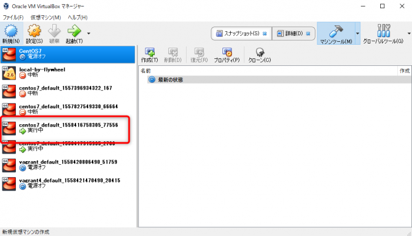

- **VirtualBox：**ローカル 開発環境に仮想マシンを作れるソフト
- **Vagrant：**VirtualBoxでローカル開発環境を作るときに便利なソフト

## VirtualBoxのインストール

以下で、VirtualBoxをインストール  
[https://www.virtualbox.org/](https://www.virtualbox.org/)

インストールが始まったら、とりあえず、すべてYesで進む。

## Vagrantのインストール

以下で、Windows版のVagrantをインストール  
[https://www.vagrantup.com/downloads.html](https://www.vagrantup.com/downloads.html)

インストールが始まったら、とりあえず、すべてYesで進む。

Vagrantがインストールされているか確認する。  
コマンドプロンプト、またはその他のターミナルソフトを立ち上げて、  
以下のコマンドを入力。

```
vagrant -v
Vagrant 2.2.4
```

## イメージファイルのインストール

### Vagrantの専用フォルダを作成

Vagrantのイメージファイルをインストールしていきますが、  
その前にまずは、Vagarantの専用のフォルダを作成します。  
コマンドプロンプトで、以下のようにフォルダを作成し移動しておきます。

```
mkdir C:\vagrant
cd  C:\vagrant
mkdir centos7
cd centos7
```

### Boxを検索してインストール

VagrantにはBoxファイルという、仮想マシンのテンプレートなるイメージファイルがあります。

以下のURLで、色々なBoxファイルを見つけることができます。  
[https://app.vagrantup.com/boxes/search](https://app.vagrantup.com/boxes/search)

「centos」で検索すると、たくさんヒットしますが、今回は「centos/7」を使おうと思います。

コマンドプロンプトで、以下のコマンドを入力してVagrantを初期化します。

```
vagrant init centos/7
```

これで、フォルダに「Vagrantfile」が作成されます。

## **Vagrantfile**の編集

Vagrantfileをテキストエディタで開いて確認と編集します。

以下の項目が指定したBox名の「centos/7」になっていることを確認します。

```
config.vm.box = "centos/7"
```

次に、以下の項目の先頭の「#」を削除してください。

```
config.vm.network "private_network", ip:"192.168.33.10"
```

## 仮想マシンの起動

Vagrantfileを編集後、保存したら、以下のコマンドで仮想マシンを起動します。

```
vagrant up
```

## VirtualBoxで起動を確認

VirtualBoxでインストールした仮想マシンが起動しているのを確認できます。



## 仮想マシンにSSH接続

コマンドプロンプトで、以下のコマンドを入力することで、仮想マシンへログインすることができます。

```
vagrant ssh
```

以下のように、確認できれば接続完了です。

```
[vagrant@localhost ~]$
```

[Windows10 + VirtualBox + VagrantでLAMP開発環境手順（2）](https://blog.popweb.dev/server/vagrant/local-development-environment-2/)に続く
