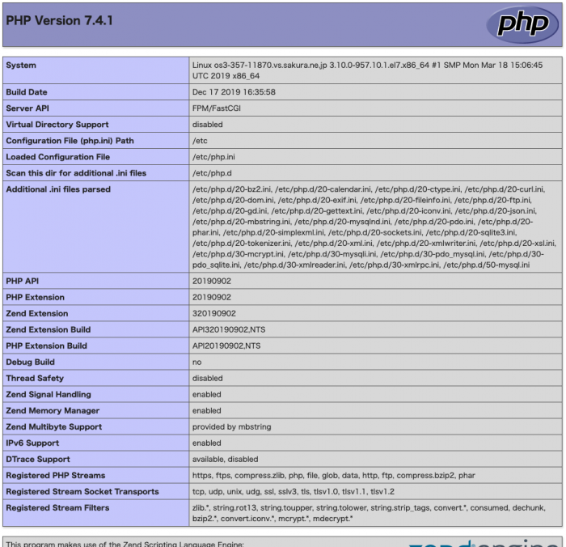

さくらVPSでCentOS7+Nginx+PHP7+MariaDBの構築手順を説明する。

Nginxのインストールと設定については、以前の記事を参照。

・[【さくらVPS】Nginxのインストール手順](https://blog.pop-web.net/programming/nginx-install/)

・[【さくらVPS】Nginxバーチャルホストの設定](https://blog.pop-web.net/programming/nginx-virtualhost/)

## PHP5系の削除

もしデフォルトでPHP5系の古いバージョンのPHPがインストールされている場合は、削除する。

以下のコマンドですでにPHPがインストールされていないか確認する。

```
sudo yum list installed | grep php
```

何も表示されなければ、PHPはインストールされていない。

もし、PHPがインストールされていれば、以下のコマンドで削除する。

```
sudo yum remove php*
```

## remiレポジトリの追加

最新のPHPモジュールを取得するために、Redhat enterprise linux 7用のremiレポジトリをインストールする。

```
sudo yum -y install http://rpms.famillecollet.com/enterprise/remi-release-7.rpm
```

最後に、『完了しました！』が表示されればOK。

追加されたレポジトリファイルは「/etc/yum.repos.d/」に置かれるので、PHP関連のファイルがあるか確認しておく。

```
ls /etc/yum.repos.d/
CentOS-Base.repo       epel.repo          remi-php70.repo
CentOS-CR.repo         nginx.repo         remi-php71.repo
CentOS-Debuginfo.repo  remi-glpi91.repo   remi-php72.repo
CentOS-Media.repo      remi-glpi92.repo   remi-php73.repo
CentOS-Sources.repo    remi-glpi93.repo   remi-php74.repo
CentOS-Vault.repo      remi-glpi94.repo   remi-safe.repo
CentOS-fasttrack.repo  remi-modular.repo  remi.repo
epel-testing.repo      remi-php54.repo
```

## PHP74パッケージのインストール

以下のコマンドでPHP7.4と必要なパッケージらをインストールする。

```
sudo yum -y install --enablerepo=remi,remi-php74 php php-mbstring php-xml php-xmlrpc php-gd php-pdo php-pecl-mcrypt php-mysqlnd php-pecl-mysql
```

### PHPがインストールされたか、バージョンの確認

以下のphpコマンドで、PHPバージョンを確認する。

```
php -v
PHP 7.4.1 (cli) (built: Dec 17 2019 16:35:58) ( NTS )
Copyright (c) The PHP Group
Zend Engine v3.4.0, Copyright (c) Zend Technologies
```

上記のようになれば、PHP7.4がインストールされたこととなる。

## php.iniの基本設定

「/etc/php.ini」ファイルを編集して基本設定を行う。

```
sudo vi /etc/php.ini
```

### HTTPヘッダーのバージョン非表示

セキュリティ的にバージョンは非公開の方がいいので非表示にしておく。

```
expose_php = On
↓
expose_php = Off
```

### アップロードサイズの変更

デフォルト設定ではアップロードできるファイルサイズが小さいので変更しておく。

```
post_max_size = 8M
↓
post_max_size = 20M
```

```
upload_max_filesize = 2M
↓
upload_max_filesize = 20M
```

### タイムゾーンの設定

タイムゾーンは、”Asia/Tokyo”に設定しておく。アプリケーションで時間を扱う場合これを設定しておかないと挙動がおかしくなってしまいます。

```
;date.timezone =
↓
date.timezone = "Asia/Tokyo"
```

### マルチバイト対応

日本語を利用する場合、マルチバイト対応の設定が必要になる。

mbstringの言語デフォルト値を定義するmbstring.languageを設定。

```
;mbstring.language = Japanese
↓
mbstring.language = Japanese
```

内部文字エンコーディングの設定をUTF-8へ設定する。

```
;mbstring.internal_encoding =
↓
mbstring.internal_encoding = UTF-8
```

HTTP通信時のinput文字コードもUTF-8に指定。

```
;mbstring.http_input =
↓
mbstring.http_input = UTF-8
```

HTTP 出力文字コードを指定するmbstring.http\_outputは、自動変換を不可にするのでpassを指定する。

```
;mbstring.http_output =
↓
mbstring.http_output = pass
```

HTTP入力変換を有効化する。

```
;mbstring.encoding_translation = Off
↓
mbstring.encoding_translation = On
```

文字コードの自動検出の優先順位の設定するmbstring.detect\_orderを編集する。autoにしておくとUTF-8がデフォルトで選択されるためautoにしておく。

```
;mbstring.detect_order = auto
↓
mbstring.detect_order = auto
```

変換不可の文字列がある場合、代わりの文字を表示させないようにmbstring.substitute\_characterを有効にする。

```
;mbstring.substitute_character = none
↓
mbstring.substitute_character = none
```

これで、php.iniファイルの設定は以上。

## php-fpmのインストール

php-fpm(FastCGI Process Manager)は、phpスクリプトをCGIで動かすためのパッケージ。

ちなみに、phpはモジュール版とCGI版があり、Apacheではモジュール版が使用される。Webサーバーのプロセス内でPHPを実行するやり方。

一方、CGI版は、Webサーバとは別プロセセスで実行させるやり方。Nginxではモジュール版がないので、CGI版を使っていくこととなる。

php-fpmパッケージは、remiレポジトリにあるため以下のコマンでインスールできる。

```
sudo yum -y install --enablerepo=remi,remi-php74 php-fpm
```

最後に、「完了しました！」が表示されればOK。

インストールされたかの確認は、以下のコマンドを入力。

```
sudo yum list installed | grep php-fpm
php-fpm.x86_64 7.4.1-1.el7.remi @remi-php74
```

上記のような表示になればOK。

## php-fpm設定ファイルの変更

php-fpm設定ファイルを変更していく。

まずはバックアップをとる。

```
sudo cp -p /etc/php-fpm.d/www.conf /etc/php-fpm.d/www.conf.org
```

### www.confファイルの編集

以下のコマンドでwww.confを編集していく。

```
sudo vi /etc/php-fpm.d/www.conf
```

まずは、nginxのシステムユーザをwwwに変更する。

```
; RPM: apache user chosen to provide access to the same directories as httpd
user = apache
; RPM: Keep a group allowed to write in log dir.
group = apache
↓
; RPM: apache user chosen to provide access to the same directories as httpd
user = www
; RPM: Keep a group allowed to write in log dir.
group = www
```

編集が終わったら保存しておく。

## php-fpmの起動

php-fpmを起動する。

```
sudo systemctl start php-fpm
```

起動されているかの確認。

```
sudo systemctl status php-fpm
```

「Active: active (running)」になっていればOK。

## php-fpm自動起動設定

サーバ再起動時にも、php-fpmが自動的に起動するように設定する。

```
sudo systemctl enable php-fpm
```

自動起動が設定されていることを確認。

```
sudo systemctl is-enabled php-fpm
enabled
```

上記のように「enabled」と表示されればOK。

## Nginxの設定変更

次は、nginxでphp-fpmへスクリプトのファイルが動作するにようにNginx側の設定を変更する。

default.confを編集する。

```
sudo vi /etc/nginx/conf.d/default.conf
```

locationディレクティブへ、index.phpを追加する。

```
location / {
  index index.html index.htm;
}
↓ 
location / {
  index index.php index.html index.htm;
}
```

また、locationディレクティブの下へ、以下のPHP用の設定内容を追記する。

```
location ~ \.php$ {
  fastcgi_pass 127.0.0.1:9000;
  fastcgi_index index.php;
  fastcgi_param SCRIPT_FILENAME $document_root$fastcgi_script_name;
  include fastcgi_params;
}
```

設定ファイルを保存して、以下のコマンドを入力して設定ファイルに間違いがないかチェックする。

```
sudo nginx -t
nginx: the configuration file /etc/nginx/nginx.conf syntax is ok
nginx: configuration file /etc/nginx/nginx.conf test is successful
```

上記のように「syntax is ok」と「test is successful」を表示がでればOK。

## Nginxの再起動

Nginxの設定を変更したのでこれを反映させるため、Nginxを再起動する。

```
sudo systemctl restart nginx
```

## テスト用のPHPファイルを作成

PHPが実行されているか、バーチャルホストのドキュメントルートへphpファイルを配置する。

```
sudo vi /home/www/yusuke.com/index.php
```

フィアルの内容は以下。

```
<?php
    phpinfo();
?>
```

## ブラウザで動作確認

ブラウザを起動して、yusuke.comを表示する。

**※**この動作確認では、DNS設定の必要で、ドメイン名（blog.pop-web.net）からIPが引けるようにしておく。ドメインをお名前ドットコム等のサービスで取得している場合は、ネームサーバ設定変更で、さくらのVPSのネームサーバを指定しておけば良い。

以下のようにphpinfoの表示がされればOK。



## MariaDBバージョン5系の削除

MariaDBをインストールしていく。

バージョンは10系をいれていくので、すでにデフォルトでMariaDBがインストールされていないか確認。

```
sudo yum list maria*
```

```
インストール済みパッケージ
mariadb-libs.x86_64                          1:5.5.64-1.el7
```

上記のような表示が出た場合、MariaDBの5.5がインストールされていることとなる。

10系をインストールするので、このMariaDB5.5は削除する。

```
sudo yum remove mariadb-libs
```

以下のコマンドで削除されたかの確認。

```
sudo yum list installed | grep mariadb-libs
```

なにも表示されなければ削除されたことが確認できる。

## MariaDBレポジトリの作成

現状のレポジトリを確認する。

```
ls -a /etc/yum.repos.d/
.                      epel-testing.repo  remi-php70.repo
..                     epel.repo          remi-php71.repo
CentOS-Base.repo       nginx.repo         remi-php72.repo
CentOS-CR.repo         remi-glpi91.repo   remi-php73.repo
CentOS-Debuginfo.repo  remi-glpi92.repo   remi-php74.repo
CentOS-Media.repo      remi-glpi93.repo   remi-safe.repo
CentOS-Sources.repo    remi-glpi94.repo   remi.repo
CentOS-Vault.repo      remi-modular.repo
CentOS-fasttrack.repo  remi-php54.repo
```

ここへ、MariaDBレポジトリを追加する。

レポジトリファイルの内容は、MariaDB公式サイトの作成画面を参考にする。

まず、[MariaDB公式サイトのDownloads画面](https://downloads.mariadb.org/mariadb/repositories/#mirror=cyanlink)へいく。

環境に合わせて、以下のように選択していく。

「CentOS」→「CentOS 7 (x86\_64)」→「10.4 \[Stable\]」

選択が終わると、自動でレポジトリファイルの内容が生成されるので、これをコピーしておく。

!\[スクリーンショット 2020-01-04 15.51.05\](/Users/koga/Dropbox/md/投稿済み/img/スクリーンショット 2020-01-04 15.51.05.png)

次に、コピー先であるレポジトリファイルを作成する。

```
sudo vi /etc/yum.repos.d/mariadb.repo
```

先ほど、コピーした内容を貼り付ける。

※また、レポジトリを有効化するため最終行に「**enable=1**」を追記する。

```
# MariaDB 10.4 CentOS repository list - created 2020-01-04 06:50 UTC
# http://downloads.mariadb.org/mariadb/repositories/
[mariadb]
name = MariaDB
baseurl = http://yum.mariadb.org/10.4/centos7-amd64
gpgkey=https://yum.mariadb.org/RPM-GPG-KEY-MariaDB
gpgcheck=1
enable=1
```

これでファイルを保存すれば、レポジトリの追加完了。

yumコマンドでMariaDBをインストールする。

```
sudo yum -y install MariaDB-devel MariaDB-client MariaDB-server
```

最後に、「完了しました！」が表示されればOK。

インストールされたか、以下のコマンドで確認。

```
sudo yum list installed | grep MariaDB
MariaDB-client.x86_64                10.4.11-1.el7.centos            @mariadb
MariaDB-common.x86_64                10.4.11-1.el7.centos            @mariadb
MariaDB-compat.x86_64                10.4.11-1.el7.centos            @mariadb
MariaDB-devel.x86_64                 10.4.11-1.el7.centos            @mariadb
MariaDB-server.x86_64                10.4.11-1.el7.centos            @mariadb
```

上記のように、バージョン10.4が確認できればOK。

## MariaDBの起動

MariaDBを以下のコマンドで起動する。

```
sudo systemctl start mariadb
```

起動したら、以下のコマンで正常起動しているか確認。

```
sudo systemctl status mariadb
```

Active: active (running)と表示されればOK。

## MariaDBの自動起動設定

サーバーの再起動時もMariaDBが起動するように設定する

```
sudo systemctl enable mariadb
```

自動起動が設定されていることを確認。

```
sudo systemctl is-enabled mariadb
enabled
```

enabledが表示されればOK。

## mysql\_secure\_installationの設定

MariaDBのセキュリティ設定をmysql\_secure\_installationで行う。

このmysql\_secure\_installationは何をしてくれるかというと、DB管理者のパスワード設定やサンプルDBの削除などしてくれる

MariaDBをインストール時には実行した方が良い。

以下のコマンドを実行。

```
sudo mysql_secure_installation
```

実行するとまず、『Enter current password for root (enter for none):』となるが、これはrootのパスワードが設定されている場合、そのパスワードを入力する。

今回はまだ設定していないので、enterキーを押下して進める。

現パスワードを確認する場合には以下のコマンドで確認できる

```
cat /var/log/mysqld.log | grep 'temporary password'
```

その後も\[Y/n\]で設定を聞かれるので、yを入力してEnterを押下。

「New password:」と出たら、新しいパスワードを入力する。

その後も、また\[Y/n\]で設定を聞かれるので、yを入力してEnterを押下。

最後に、『Thanks for using MariaDB！』と表示されれば設定は終了。

## MariaDBの基本設定

文字コードをUTF-8として設定するため、設定ファイルのserver.cnfを編集する。

まずは、バックアップとる。

```
sudo cp -p /etc/my.cnf.d/server.cnf /etc/my.cnf.d/server.cnf.org
```

server.cnfを開いて編集する。

```
sudo vi /etc/my.cnf.d/server.cnf
```

\[server\]ディレクティブに「**character-set-server=utf8**」を追記する。

```
[server]
↓
[server]
character-set-server=utf8 
```

設定を反映させるためMariaDBを再起動。

```
sudo systemctl restart mariadb
```

## MariaDBへの接続確認

MariaDBへ接続して確認をする。

以下の、コマンドで接続する。

```
sudo mysql -uroot -p[パスワード]
```

接続完了すると、以下のようなプロンプトが表示される。

```
MariaDB [(none)]>
```

作成されているデータベースを確認するため、以下のSQL文を入力

```
MariaDB [(none)]> show databases;
+--------------------+
| Database           |
+--------------------+
| information_schema |
| mysql              |
| performance_schema |
+--------------------+
3 rows in set (0.002 sec)
```

### テスト用のDBを作成

以下のSQL文で、テスト用のDBを作成する。

```
MariaDB [(none)]> create database test;
Query OK, 1 row affected (0.001 sec)
```

作成したDBへ接続。

```
MariaDB [(none)]> use test;
Database changed
```

作成したテスト用のDBの文字コードを確認し、UTF-8になっていることを以下のSQL文で確認する。

```
MariaDB [test]> show variables like "chara%";
+--------------------------+----------------------------+
| Variable_name            | Value                      |
+--------------------------+----------------------------+
| character_set_client     | utf8                       |
| character_set_connection | utf8                       |
| character_set_database   | utf8                       |
| character_set_filesystem | binary                     |
| character_set_results    | utf8                       |
| character_set_server     | utf8                       |
| character_set_system     | utf8                       |
| character_sets_dir       | /usr/share/mysql/charsets/ |
+--------------------------+----------------------------+
8 rows in set (0.001 sec)
```

UTF-8になっていることが確認できたので、テスト用で作成したDBは削除しておく。

```
MariaDB [test]> drop database test;
Query OK, 0 rows affected (0.003 sec)
```

削除したDBがなくなったことを以下のSQL文で確認する。

```
MariaDB [(none)]> show databases;
+--------------------+
| Database           |
+--------------------+
| information_schema |
| mysql              |
| performance_schema |
+--------------------+
3 rows in set (0.000 sec)
```

MariaDB接続を終わる場合は、以下のコマンドで終了する。

```
MariaDB [(none)]> quit
Bye
```

## 最後に

以上で、CentOS7 + Nginx + PHP7 + MariaDB10の環境が構築が完了。

これでようやく、PHPによるアプリケーションの実装を始めることができるようになった。
