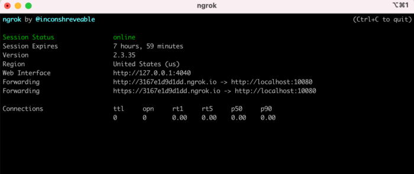

ローカル開発環境の状況を**クライアントへ確認してもらいたい時、もしくは複数端末でブラウザ確認したい時**は多々ある。

しかし、ちょっと確認してもらえればいいのに、いちいちテスト環境用のサーバを用意してにアップロードするのは面倒。

そこで、ローカル開発環境を簡単にWEB上に公開できるツール**「ngrok」**（エヌジーロック?

）を使う。

## ngrokのインストール

Homebrewがインストールしているか確認。

していなければインストールしておく。

```
$ brew -v
```

以下のコマンドでngrokをインストール

```
$ brew install --cask ngrok
又は、
$ brew cask install ngrok
```

## Dockerのローカル開発環境をWEB公開する

Dockerのローカル開発環境をWEB公開するには、まずはポートを確認。

以下のようなURLで開発環境を確認している場合

```
http://localhost:10080/
```

以下の、コマンドでngrokが起動する

```
$ ngrok http 10080
```

起動すると公開用のURLが発行される。



Forwardingのhttp://〜にアクセスすれば、WEB公開できたことが確認できる。

公開を止める時は、`Ctrl + C`。
