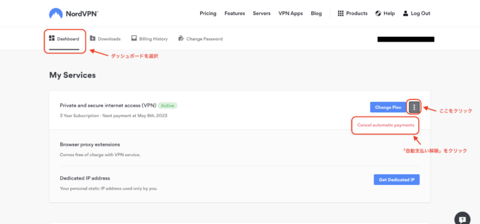
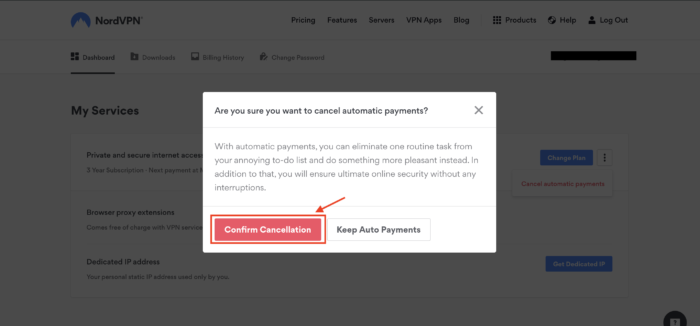
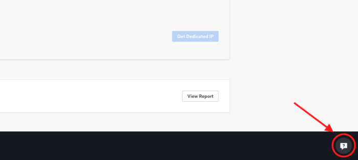
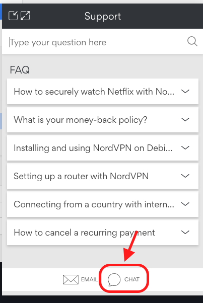
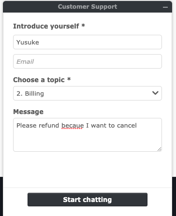
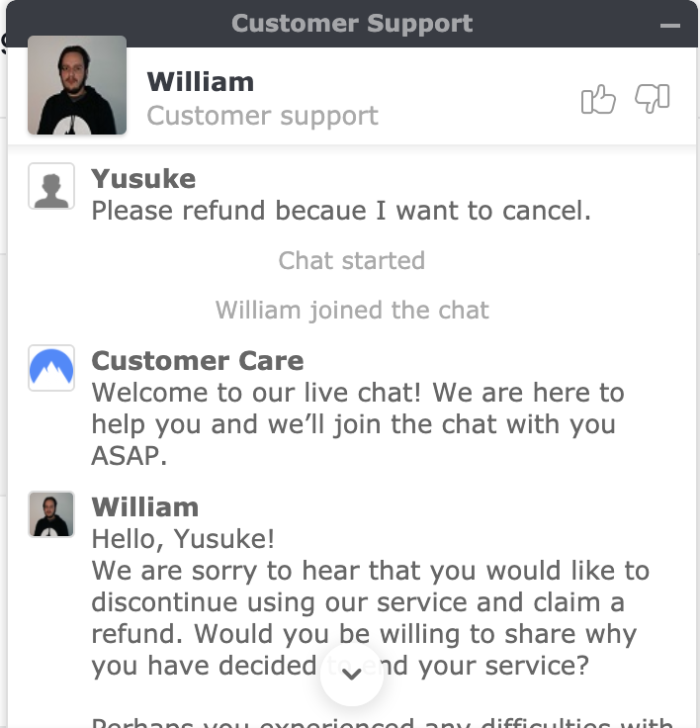
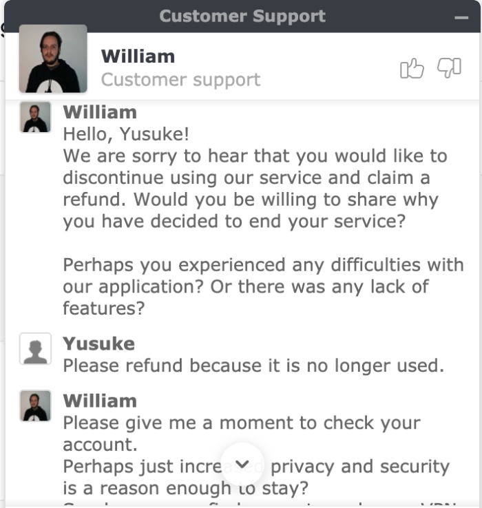
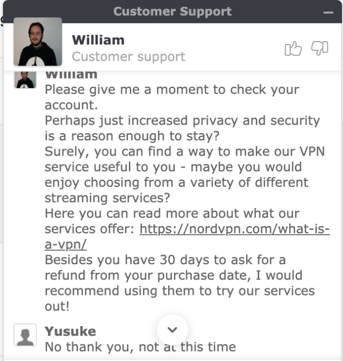
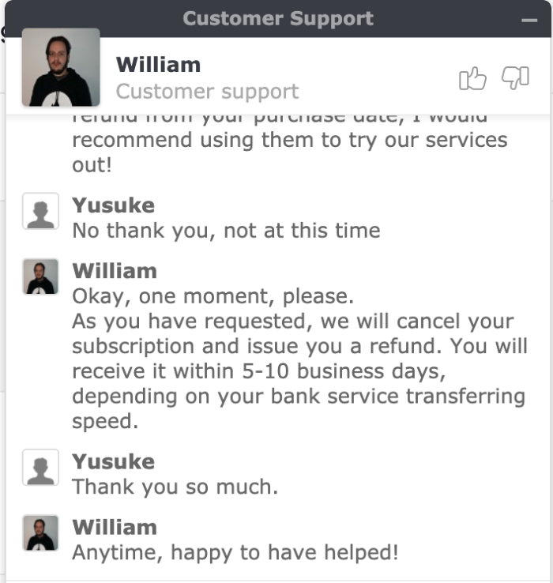

当方、MacでcNordVPNを使ってみたが、Amazonにアクセスできなかったり、使っているとブツブツ接続が切れてしまうので解約することにした。

解約することに決めたのはいいが、連絡は英語になる。

英語は苦手だが、Google翻訳などを駆使して解約した経緯を記しておく。

## まず自動支払いを解除

公式サイトのログインして、ダッシュボード画面の**「Cancel automatic payments」**をクリック。

次に、アラート画面がでるが**「Confirm Cancellation」**をクリックすれば自動支払いの解除は完了。

## チャットで返金依頼の連絡をする

右下の「？」をクリック。

Supportのウィンドウが開くので、下の**「CHAT」**をクリック。

「Introduce yurself」に、名前とメールアドレスを入力し、

「Choose a topic」は「2. Billing」（課金）を選択。

「Messege」には『Please refund because I want to cancel.』（キャンセルしたいので返金お願いします）と入力して**「Start chatting」**をクリック。

すると、カスタマースタッフとつながる。

すぐに返信を返してくれる。

色々、英文を送られてくるがGoogle翻訳とか使えばOK。

『どうして解約したいの？』

『私たちのサービスに何か問題ありましたか？』

などいった意味の文章が送られてくるが、

シンプルに、『Please refund because it is no longer used』（もう使わないから返金お願いします。）と返せば良い。

そうすると、

「あなたのアカウント確認するからちょっと待ってて」を返ってくるので待つ。

待ってると、「5~10営業日に返金するよ」と連絡が来る。

これで返金の手続きは終わり。

返金の手続きは英語で面倒だが、特に引き止められたり勧誘することはなかった。

今後、VPNサービスは**固定IPアドレス**が使えることから国内サービスである[マイIP](https://www.interlink.or.jp/service/myip/)を使うことにした。
