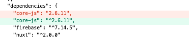

Nuxt + Firebaseで開発をしていて、Firebaseのテストモジュール入れ、開発サーバを起動したらcore.js関連のエラーがずらっと出た。

```
ERROR  Failed to compile with 77 errors                                  friendly-errors 15:28:27

These dependencies were not found:                                        friendly-errors 15:28:27
                                                                          friendly-errors 15:28:27
* core-js/modules/es.array.concat in ./.nuxt/client.js                    friendly-errors 15:28:27
* core-js/modules/es.array.every in ./.nuxt/router.scrollBehavior.js      friendly-errors 15:28:27
* core-js/modules/es.array.filter in ./.nuxt/client.js, ./.nuxt/components/nuxt-link.client.js and 2 others
* core-js/modules/es.array.find in ./.nuxt/client.js                      friendly-errors 15:28:27
* core-js/modules/es.array.for-each in ./.nuxt/client.js, ./.nuxt/components/nuxt-link.client.js and 2 others
* core-js/modules/es.array.from in ./.nuxt/client.js, ./.nuxt/components/nuxt-link.client.js
* core-js/modules/es.array.includes in ./.nuxt/client.js, ./.nuxt/components/nuxt-link.client.js
* core-js/modules/es.array.index-of in ./.nuxt/utils.js, ./node_modules/babel-loader/lib??ref--2-0!./node_modules/vue-loader/lib??vue-loader-options!./pages/index.vue?vue&type=script&lang=js&
* core-js/modules/es.array.iterator in ./.nuxt/client.js                  friendly-errors 15:28:27
* core-js/modules/es.array.join in ./.nuxt/utils.js                       friendly-errors 15:28:27
* core-js/modules/es.array.map in ./.nuxt/client.js, ./.nuxt/components/nuxt-link.client.js
* core-js/modules/es.array.reduce in ./.nuxt/utils.js, ./node_modules/babel-loader/lib??ref--2-0!./node_modules/vue-loader/lib??vue-loader-options!./.nuxt/components/nuxt-build-indicator.vue?vue&type=script&lang=js&
* core-js/modules/es.array.slice in ./.nuxt/client.js, ./.nuxt/components/nuxt-link.client.js
* core-js/modules/es.array.some in ./.nuxt/client.js                      friendly-errors 15:28:27
* core-js/modules/es.function.name in ./.nuxt/client.js, ./.nuxt/components/nuxt-link.client.js
* core-js/modules/es.object.assign in ./.nuxt/client.js                   friendly-errors 15:28:27
* core-js/modules/es.object.get-own-property-descriptor in ./.nuxt/index.js, ./node_modules/babel-loader/lib??ref--2-0!./node_modules/vue-loader/lib??vue-loader-options!./pages/index.vue?vue&type=script&lang=js& and 1 other
* core-js/modules/es.object.get-own-property-descriptors in ./.nuxt/index.js, ./node_modules/babel-loader/lib??ref--2-0!./node_modules/vue-loader/lib??vue-loader-options!./pages/index.vue?vue&type=script&lang=js& and 1 other
* core-js/modules/es.object.keys in ./.nuxt/client.js, ./node_modules/babel-loader/lib??ref--2-0!./node_modules/vue-loader/lib??vue-loader-options!./pages/index.vue?vue&type=script&lang=js& and 1 other
* core-js/modules/es.object.to-string in ./.nuxt/client.js, ./.nuxt/components/nuxt-link.client.js and 2 others
* core-js/modules/es.promise in ./.nuxt/client.js                         friendly-errors 15:28:27
* core-js/modules/es.promise.finally in ./.nuxt/client.js                 friendly-errors 15:28:27
* core-js/modules/es.regexp.constructor in ./.nuxt/utils.js               friendly-errors 15:28:27
* core-js/modules/es.regexp.exec in ./.nuxt/client.js, ./node_modules/babel-loader/lib??ref--2-0!./node_modules/vue-loader/lib??vue-loader-options!./.nuxt/components/nuxt-build-indicator.vue?vue&type=script&lang=js&
* core-js/modules/es.regexp.to-string in ./.nuxt/client.js, ./.nuxt/components/nuxt-link.client.js
* core-js/modules/es.string.ends-with in ./.nuxt/utils.js                 friendly-errors 15:28:27
* core-js/modules/es.string.includes in ./.nuxt/client.js, ./.nuxt/components/nuxt-link.client.js
* core-js/modules/es.string.iterator in ./.nuxt/client.js, ./.nuxt/components/nuxt-link.client.js
* core-js/modules/es.string.match in ./.nuxt/client.js                    friendly-errors 15:28:27
* core-js/modules/es.string.repeat in ./.nuxt/utils.js                    friendly-errors 15:28:27
* core-js/modules/es.string.replace in ./.nuxt/client.js, ./.nuxt/components/nuxt.js
* core-js/modules/es.string.search in ./.nuxt/utils.js                    friendly-errors 15:28:27
* core-js/modules/es.string.split in ./.nuxt/utils.js, ./node_modules/babel-loader/lib??ref--2-0!./node_modules/vue-loader/lib??vue-loader-options!./.nuxt/components/nuxt-build-indicator.vue?vue&type=script&lang=js&
* core-js/modules/es.string.starts-with in ./.nuxt/utils.js               friendly-errors 15:28:27
* core-js/modules/es.string.trim in ./node_modules/babel-loader/lib??ref--2-0!./node_modules/vue-loader/lib??vue-loader-options!./pages/index.vue?vue&type=script&lang=js&
* core-js/modules/es.symbol in ./.nuxt/client.js, ./.nuxt/components/nuxt-link.client.js and 2 others
* core-js/modules/es.symbol.description in ./.nuxt/client.js, ./.nuxt/components/nuxt-link.client.js
* core-js/modules/es.symbol.iterator in ./.nuxt/client.js, ./.nuxt/components/nuxt-link.client.js
* core-js/modules/web.dom-collections.for-each in ./.nuxt/client.js, ./.nuxt/components/nuxt-link.client.js and 2 others
* core-js/modules/web.dom-collections.iterator in ./.nuxt/client.js, ./.nuxt/components/nuxt-link.client.js
```

## 原因

NuxtとFirebase使われるcore.jsのバージョンが異なるため。

Nuxt側のcore.jsのバージョンを2から3へダウングレードすればいいらしい。

## 解決方法

しかし、`package.json`を見てみるとすでにバージョン2となっていた。

一応、以下コマンドでバージョン2を再度インストールしてみる。

```
$ npm install core-js@2.6.11
```

これでうまくいった。。。

package.jsonをみるとキャレットが付与しただけになっているが、これでエラーが出ないようになった。

- 
