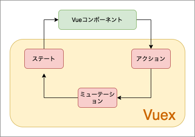

Nuxt.jsで状態管理を行うライブラリであるVuexのクラシックモードとモジュールモードについて説明。

## まず、新規Nuxtプロジェクトを作成

以下、コマンドでテスト用にNuxtプロジェクトを作成しておく。

```
npx create-nuxt-app vuex-test
```

初期設定をどうするか聞かれるが、すべてEnterキーを押下して進めてOK。

## Vuexのデータフローについて

VuexにはState、Mutation、Actionといったデータフローがある。



### State（ステート）

ストアの状態を保持しているところ。

Vueコンポーネントから直接操作をすることはできない。

### Mutation（ミューテーション）

Vuexストアの状態を唯一操作ができる。

### Action（アクション）

Mutationを呼び出す役割をする。

外部とのAPI通信したい場合はここに書く。

また、非同期処理を書く時もここに書く。

## Vuexの2つのモード

Vuexにはクラシックモードとモジュールモードの2つのモードがある。

- クラシックモードは内容を1つのファイルで管理する。（store/index.js）
- モジュールモードは内容を複数のファイルで管理する。（store/\*.js）

大規模開発になるとモジュールモードで分けた方が管理しやすい。

また、クラシックモードは次のメジャーアップデートで廃止予定…

## クラシックモードで利用

まずはStateを作成する。

### State（ステート）を使う

storeディレクトリ配下に`index.js`を作成して以下のように編集。

```
import Vuex from 'vuex'

const helloWorld = () => {
  return new Vuex.Store({
    state: function () {
      return {
        message: 'Hello, World'
      }
    }
  })
}
export default helloWorld
```

state部分が状態を管理する値を設定するところ。

stateの値はfunctionにするのがルールで、その中に状態管理したいデータをオブジェクト形式で設定する。

pagesディレクトリのindex.vueを以下のように編集する。

```
<template>
  <div style="padding:20px;">
    <p>{{ $store.state.message }}</p>
  </div>
</template>
```

`npm run dev`で開発モードで実行する。

ブラウザで確認し、「Hello, World」の表示ができればOK。

### Mutation（ミューテーション）を使う

Mutationを使ってStateの値を変更する。

`store/index.js`を編集する。

mutationsを追加する。

```
import Vuex from 'vuex'

const helloWorld = () => {
  return new Vuex.Store({
    state: function () {
      return {
        message: 'Hello, World'
      }
    },
    mutations: {
      updateData: function (state, payload) {
        state.message = payload
      }
    }
  })
}
export default helloWorld
```

functionに第二引数（payload）を設定するとは、Vueコンポーネントから値と受け取ることができる。

次に、index.vueにmutationsに処理をさせるボタンを設置する。

```
<template>
  <div style="padding:20px;">
    <p>{{ $store.state.message }}</p>
    <br />
    <button @click="$store.commit('updateData', 'send mutations')">
      mutations！
    </button>
  </div>
</template>
```

$store.commitの第二引数に渡したい値を入れる。

ブラウザで確認して、ボタンをクリックすると「send mutations」と表示が切り替わればOK。

### Action（アクション）を使う

`store/index.js`を編集する。

actionsを追加する。

```
import Vuex from 'vuex'

const helloWorld = () => {
  return new Vuex.Store({
    state: function () {
      return {
        message: 'Hello, World'
      }
    },
    mutations: {
      updateData: function (state, payload) {
        state.message = payload
      }
    },
    actions: {
      updateDataAction(context) {
        context.commit('updateData', 'send actions')
      }
    }
  })
}
export default helloWorld
```

次にindex.vueを編集してactionsを実行できるようにする。

`$store.commit`を`$store.dispatch`に変更。

```
<template>
  <div style="padding:20px;">
    <p>{{ $store.state.message }}</p>
    <br />
    <button @click="$store.dispatch('updateDataAction')">
      actions！
    </button>
  </div>
</template>
```

ブラウザで確認して、ボタンをクリックすると「send actions」と表示が切り替わればOK。

さらに、`$store.dispatch`の第二引数に値を渡すこともできる。

index.vueを以下のように変更

```
<template>
  <div style="padding:20px;">
    <p>{{ $store.state.message }}</p>
    <br />
    <button @click="$store.dispatch('updateDataAction','add value')">
      actions！
    </button>
  </div>
</template>
```

`store/index.js`でも値を受け取れるように設定。

```
import Vuex from 'vuex'

const helloWorld = () => {
  return new Vuex.Store({
    state: function () {
      return {
        message: 'Hello, World'
      }
    },
    mutations: {
      updateData: function (state, payload) {
        state.message = payload
      }
    },
    actions: {
      updateDataAction(context, payload) {
        context.commit('updateData', payload)
      }
    }
  })
}
export default helloWorld
```

ブラウザで確認して、ボタンをクリックすると「add value」と表示が切り替わればOK。

## モジュールモードで利用

今まで記述してきたクラシックモードをモジュールモードに変換していく。

モジュールモードを有効になる条件として、`store/index.js`をexportしないこと、又は`store/index.js`自体が存在しないことがあげられる。

storeディレクトリ配下に、jsファイルをおくことモジュールとして自動登録される。

モジュール名も作成したファイル名となる。

### モジュールモードのファイルを作成

storeディレクトリ配下に`helloworld.js`を作成し、クラシックモードからモジュールモードに書き換えるよう、以下のように編集する。

```
export const state = () => ({
  message: 'Hello, World'
})

export const mutations = {
  updateData: function (state, payload) {
    state.message = payload
  }
}

export const actions = {
  updateDataAction(context, payload) {
    context.commit('updateData', payload)
  }
}
```

次に、index.vueの編集もする。

```
<template>
  <div style="padding:20px;">
    <p>{{ $store.state.helloworld.message }}</p> //$store.stateの後に『helloworld.』を追加
    <br />
    <button
      @click="$store.dispatch('helloworld/updateDataAction', 'add value')" // 『helloworld/』を追加
    >
      actions！
    </button>
  </div>
</template>
```

最後にいらなくなった、`store/index.js`を削除。

最後に、ブラウザで確認して、ボタンをクリックすると「Hello, World」が「add value」へと表示が切り替わればOK。
