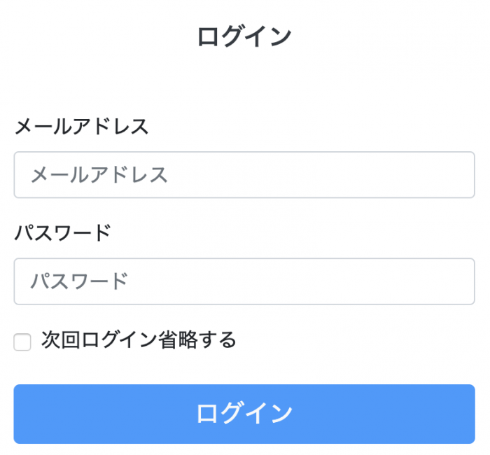

SQLインジェクションとは、Webアプリケーションに対する攻撃方法のこと。

まず、攻撃者はWebアプリケーションの入力フォームといったインターフェース利用する。

そして、入力フォームにSQL文を入力し組み込むことでアプリケーション側では意図としないSQL文が生成されて、情報の不正取得や改竄を行われてしまう。

## 攻撃手法の例

以下のようなログイン入力フォームがあるとする。



そして、ログイン認証処理のSQL文が以下になっていたとする。

```
"SELECT * FROM users WHERE email='" . $email . "' AND password='" . $pass . "'"
```

このフォームにメールアドレスに適当な文字列、パスワード入力フォームに「' or '1'='1」を入力して実行すると以下のようなSQL文が組み立てられることとなる。

```
"SELECT * FROM users WHERE email='test' AND password='' or '1'='1'"
```

WHERE句に最後に「or '1'='1'」に追加されることとなり、SQLの実行結果としてテーブルのすべてのレコードが取得できる。

仮に、レコードが取得できればログインできるようなロジック処理になっていればユーザ名とパスワードが不明でもログインできてしまうことになる。

## 対策方法

対策方法として、プリペアード・ステートメント（Prepared Statement）の利用がある。

プリペアード・ステートメントは、WHERE句でユーザー入力によって変化する部分をプレースフォルダにしてSQL文を用意しておき、その後にプレースフォルダ部分を差し替える方法。

こうすることで、事前にプレースフォルダを割り当てて用意したSQL文の構造をあとから変更することができないようになり、SQLインジェクションの対策となる。

以下、PHPの場合の例

```
$stmt = $db->prepare('SELECT * FROM users WHERE id = :id');
$stmt->execute(array(':id' => $id));
```

「:id」の部分がプレースフォルダとなっている。そしてexecuteでクエリ実行の際に引数としてプレースフォルダと値をバインドする。
