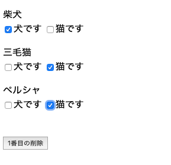
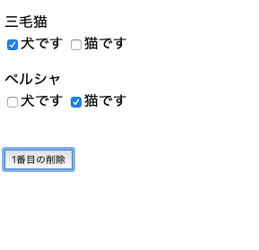
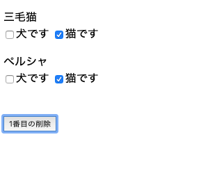

## v-forディレクティブにはkey属性が必須

v-forディレクティブを使う場合、**v-bindディレクティブへ一意（ユニーク）のkey属性を設定すること必須である。**

key属性がない場合はどう言ったバグが起こるのか簡単に説明する。

## バグが起きる例

以下のように、key属性を指定しない場合。

dataにpetsという配列のプロバティ名を用意して、v-forで繰返し表示させている。

methodsには1番目のアイテムを削除するにようクリックイベントを用意している。

### HTML

```
<div id="app">
  <div v-for="(pet,index) in pets">
    <p>
      {{ pet }}<br />
      <label><input type="checkbox">犬です</label>
      <label><input type="checkbox">猫です</label>
    </p>
  </div>
  <br />
  <button @click="del">1番目の削除</button>
</div>
```

### JavaScript

```
new Vue({
	el:"#app",
	data:{
  	pets:['柴犬','三毛猫','ペルシャ']
  },
  methods:{
  	del(){
    	this.pets.splice(0,1)
    }
  }
})
```

画面で表示後、以下のようにチェックボックスを選択したとする。



そして、「1番目の削除」押して1番目の柴犬を削除する。

そうすると、以下のように柴犬は削除されるが、柴犬の選択したチェックボックス状態を、下にあった三毛猫が引き継いだ状態となってしまう。



key属性を指定しないとこういった思わぬバグが発生する。

## key属性を指定して修正

key属性を指定してコードを修正する。

### HTML

```
<div id="app">
  <div v-for="(pet,index) in pets" :key="pet">
    <p>
      {{ pet }}<br />
      <label><input type="checkbox">犬です</label>
      <label><input type="checkbox">猫です</label>
    </p>
  </div>
  <br />
  <button @click="del">1番目の削除</button>
</div>
```

修正内容は`:key="pet"`を追記しただけ。

これで、再度画面を表示させて「1番目の削除」押して1番目の柴犬を削除する。

そうすると今度は期待通りに柴犬で選択したチェックボックスも削除された状態になる。



## key属性にインデックスは指定しないこと

key属性をするときに、やってしまいがちなミスとしては**key属性にインデックスを指定しまうこと。**

```
<div v-for="(pet,index) in pets" :key="index">
```

これをやってしまうと、**一意ではなくなってしまうのでやってはいけない。**
