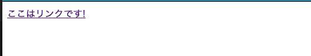
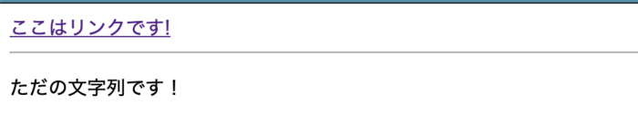
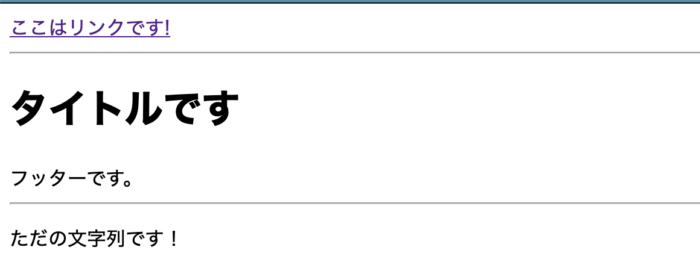

Vue.jsのスロットの使い方をざっくり説明する。

開発には[Vue CLI](https://blog.pop-web.net/programming/vue-js/vue-cli-install/)を使っている前提で話を進めていく。

## スロットコンテンツ

スロットコンテンツでは、親コンポーネントから子コンポーネントへコンテンツを丸ごと渡しあげることができる。

まず、以下の親コンポーネントを用意する。

子コンポーネントである`textLink`を読み込むように用意しておく。

子コンポーネントへの渡し方は簡単で、コンポーネントの間に何か要素を入れることで渡すことができる。

今回は「ここはリンクです!」とうただの文字列。

#### App.vue

```
<template>
  <div id="app">
    <textLink url="/#">
      ここはリンクです!
    </textLink>
  </div>
</template>

<script>
import textLink from "./components/textLink";

export default {
  components: {
    textLink,
  },
};
</script>
```

次に、子コンポーネントの`textLink`を作成する。

機能的にはテキストリンクを配置するだけのもの。

子コンポーネントには受け渡し口として`<slot />`を配置する。

#### textLink.vue

```
<template>
  <a :href="url" class="nav-link">
    <slot />
  </a>
</template>

<script>
export default {
  props: ["url"],
};
</script>
```

これで、`<slot />`の部分が「ここはリンクです!」に置換される。

ブラウザで確認すると以下のようにテキストリンクになっていることがわかる。



## フォールバックコンテンツ

親コンポーネント側から何か要素を送るときに、その要素が何もない場合に表示させるコンテンツを決めることができる。

それがフォールバックコンテンツ。

どうするかというと、子コンポーネント側の`<slot>`タグの中身に何か要素を入れてあげるだけで良い。

#### textLink.vue

```
<template>
  <div>
    <a :href="url" class="nav-link">
      <slot>デフォルトのリンクだよ！</slot>
    </a>
  </div>
</template>

<script>
export default {
  props: ["url"],
};
</script>
```

## 名前付きスロット

名前付きスロットはその名の通り名前をつけて区別するスロットのこと。

つまり、区別できるので**複数のスロットを使うことができる。**

まずは、親コンポーネントを編集する。

以下のよう。

#### App.vue

```
<template>
  <div id="app">
    <textLink url="/#">
      <template v-slot:link> // ※templateタグでv-slot:<スロット名>とする。
        ここはリンクです!
      </template>
      <template v-slot:string> // ※templateタグでv-slot:<スロット名>とする。
        ただの文字列です！
      </template>
    </textLink>
  </div>
</template>

<script>
import textLink from "./components/textLink";

export default {
  components: {
    textLink,
  },
};
</script>
```

以上のように、親コンポーネントではtemplateタグごとにv-slotで名前をつけて設定する。

ちなみに、`v-slot:`は`#`として省略記号で置き換えることができる

次に子コンポーネント。

#### textLink.vue

```
<template>
  <div>
    <a :href="url" class="nav-link">
      <slot name="link" />　// 親コンポーネントで付けた名前でname=<スロット名>とする
    </a>
    <hr />
    <p>
      <slot name="string" />　// 親コンポーネントで付けた名前でname=<スロット名>とする
    </p>
  </div>
</template>

<script>
export default {
  props: ["url"],
};
</script>
```

<slot />タグにさっき親コンポーネントで設定した名前をnameプロパティとして設定する。

ブラウザで確認してみる。



これで複数のスロットを区別して設定することができた。

## 名前付きでないデフォルトのスロットについて

先ほどの子コンポーネントのコードに名前付きでないslotタグを設置してみる。

#### textLink.vue

```
<template>
  <div>
    <a :href="url" class="nav-link">
      <slot name="link" />
    </a>
    <hr />
    <slot /> // 追加
    <hr />
    <p>
      <slot name="string" />
    </p>
  </div>
</template>
```

親コンポーネントに`<h1>`と、`<footer>`タグを追加。

#### App.vue

```
<template>
  <div id="app">
    <textLink url="/#">
      <h1>タイトルです</h1> // 追加
      <template v-slot:link>
        ここはリンクです!
      </template>
      <template v-slot:string>
        ただの文字列です！
      </template>
      <footer>フッターです。</footer> // 追加
    </textLink>
  </div>
</template>
```

これはどうなるかというと、`<h1>`と`<footer>`は合体でして子コンポーネントの名前なしslotに置換される。

ブラウザで確認する。



また、親コンポーネントでv-slotがつかない要素は一旦、v-slot:defaultという名前でtemplateタグに集約されて子コンポーネントに置換されるという動作をする。

なので、さっきの親コンポーネントのコードを以下のようにv-slot:defaultで書いても同じ結果が得られる。

#### App.vue

```
<template>
  <div id="app">
    <textLink url="/#">
      <template v-slot:default> // v-slot:defaultとすることもできる
        <h1>タイトルです</h1>
        <footer>フッターです。</footer>
      </template>
      <template v-slot:link>
        ここはリンクです!
      </template>
      <template v-slot:string>
        ただの文字列です！
      </template>
    </textLink>
  </div>
</template>
```

## スロットプロパティで子から親へ

子コンポーネントのデータを親コンポーネントで使いたい時は、スロットプロパティを使用する。

まず、子コンポーネントの`<slot>`を以下ように編集する。

#### textLink.vue

```
<template>
  <div>
    <a :href="url" class="nav-link">
      <slot name="link" title="タイトルリンクです！" /> // title="タイトルリンクです！" を追加した
    </a>
  </div>
</template>

<script>
export default {
  props: ["url"],
};
</script>
```

追加した「title="タイトルリンクです！"」を親側で表示させるための、以下のように親コンポーネントを編集する。

### App.vue

```
<template>
  <div id="app">
    <textLink url="/#">
      <template v-slot:link="slotProps">　// ="slotProps" を追加
        <h2>{{ slotProps.title }}</h2> // slotPropsの中身を表示
        ここはリンクです!
      </template>
    </textLink>
  </div>
</template>

<script>
import textLink from "./components/textLink";

export default {
  components: {
    textLink,
  },
};
</script>
```

受け取る変数のslotPropsは、なんでも好きな名前を付けれる。

これをブラウザで確認する以下のような感じになる。


また、名前付きスロットを使わずに、デフォルトスロットしかない場合は以下のようにも書ける。

#### App.vue

```
<template>
  <div id="app">
    <textLink url="/#" v-slot:default="slotProps"> // templateタグを削除してコンポネートタグにv-slotが書ける
      <h2>{{ slotProps.title }}</h2>
      ここはリンクです!
    </textLink>
  </div>
</template>
```

#### textLink.vue

```
<template>
  <div>
    <a :href="url" class="nav-link">
      <slot title="タイトルリンクです！" /> // name="link"を消去
    </a>
  </div>
</template>
```

さらに、`v-slot:default`の`:default`もなくして省略ができる。

```
<template>
  <div id="app">
    <textLink url="/#" v-slot="slotProps">
      <h2>{{ slotProps.title }}</h2>
      ここはリンクです!
    </textLink>
  </div>
</template>
```

以上、スロットの説明終わり。
