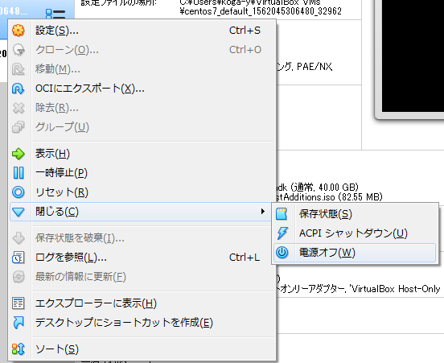
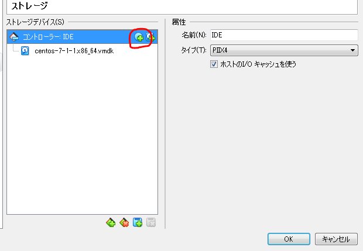
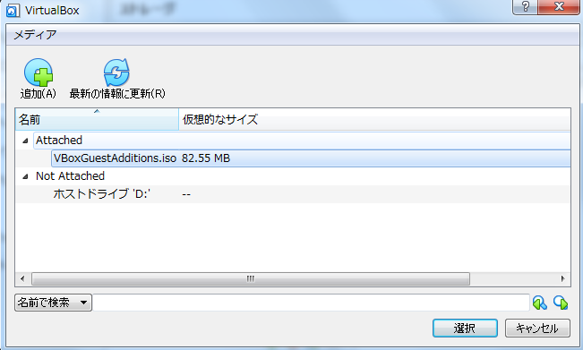

以前、[Vagrantでローカルとサーバ側のデータを同期する共有フォルダの設定手順](https://blog.pop-web.net/programming/vagrant-shared-folder/)という記事を書いたが、プラグインである「vagrant-vbguset」が、カーネルのバージョン違いでうまく動作しない場合があるので、プラグイン「vagrant-vbguset」 を使わない共有フォルダの設定手順をまとめます。

## vagrant-vbgusetアンインストール

「vagrant-vbguset」は使わない方法をとるので、インストールしている場合はアインインストールしておきます。

```
vagrant plugin uninstall vagrant-vbguest
```

アンインストールされていることを確認します。

```
vagrant plugin list
```

まだなにもインストールしていない場合は、Vagrantのインストールをして仮想マシンでCentOS7までインストールしておきましょう。

手順はこちらを参考に  
[Windows10 + VirtualBox + VagrantでLAMP開発環境手順（1）](https://blog.pop-web.net/programming/local-development-environment/)

## VirtualBoxにisoイメージファイルを挿入

VirtualBoxでの作業になります。

まず、設定する仮想マシンを電源オフします。



「ストレージ」選択して、ディスクの選択アイコンをクリック。



「ディスクを選択」ボタンを押します。

追加ボタンを押して、「VBoxGuestAddition.iso」を選択します。



※「VBoxGuestAddition.iso」 がある場所は、OracleディレクトリのVirtualBoxの中にあります。

Windowsの場合は、以下。

```
C:\Program Files\Oracle\VirtualBox
```

## VBoxGuestAdditionのインストール

コンソール画面に戻って、vagrantで仮想マシンの起動します。

```
vagrant up
```

サーバーへログインします。

```
vagrant ssh
```

## 事前に必要なもの

事前準備として以下のパッケージが必要となります。

```
kernel-headers kernel-devel gcc make
```

インストールされているか確認

```
yum list installed | grep kernel
```

```
rpm -qa | grep kernel-headers
rpm -qa | grep kernel-devel
rpm -qa | grep make
rpm -qa | grep gcc
```

なければ、インストール

```
sudo yum install kernel-headers kernel-devel gcc make
```

kernelのバージョンの差異があるとうまくいかないので、バージョンの確認をしておきます。

```
yum list installed | grep kernel
```

```
kernel.x86_64                       3.10.0-957.5.1.el7          @koji-override-1
kernel-devel.x86_64                 3.10.0-957.21.3.el7         @updates
kernel-headers.x86_64               3.10.0-957.21.3.el7         @updates
kernel-tools.x86_64                 3.10.0-957.5.1.el7          @koji-override-1
kernel-tools-libs.x86_64            3.10.0-957.5.1.el7          @koji-override-1
```

上記のように、kernel-develとkernel-headersのバージョンが異なっています。

バージョンをあわす為に、kernelのアップデートをします。

```
sudo yum update kernel
```

再度、バージョンがそろったか確認します。

```
yum list installed | grep kernel
```

```
kernel.x86_64                       3.10.0-957.5.1.el7          @koji-override-1
kernel.x86_64                       3.10.0-957.21.3.el7         @updates
kernel-devel.x86_64                 3.10.0-957.21.3.el7         @updates
kernel-headers.x86_64               3.10.0-957.21.3.el7         @updates
kernel-tools.x86_64                 3.10.0-957.5.1.el7          @koji-override-1
kernel-tools-libs.x86_64            3.10.0-957.5.1.el7          @koji-override-1
```

次に、GuestAdditionsをマウントします。

```
sudo mkdir -p /mnt/cdrom
sudo mount -r /dev/cdrom /mnt/cdrom
```

マウントがされて、「/mnt/cdrom」にファイルがたくさんあることを確認します。

```
ls -la  /mnt/cdrom 
```

GuestAdditionsをインストールします。

```
sudo sh /mnt/cdrom/VBoxLinuxAdditions.run
```

インストールが完了したら、今度はVagrantfileを編集するので、ログアウトしておきます。

```
exit
```

## 共有フォルダの設定

Vagrantfileを編集します。

```
vi Vagrantfile
```

「config.vm.synced\_folder」の箇所のコメントアウトをはずして、共有するゲストOSをホストOSのフォルダをそれぞれ設定します。

```
config.vm.synced_folder "C:\\Users\\username\\Documents\\project", "/usr/local/bin"
```

vagrant設定の更新をするため、再起動します。

```
vagrant halt
vagrant up
```

起動したら、サーバーにログインして共有されていることを確認します。

```
vagrant ssh
ls -l /usr/local/bin
```
