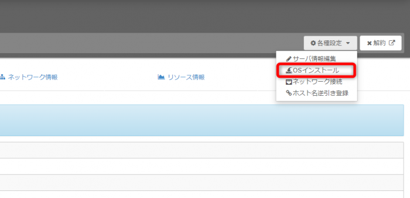
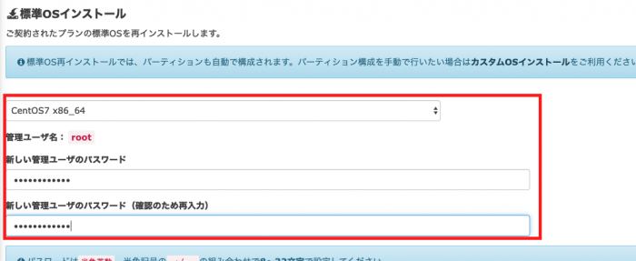
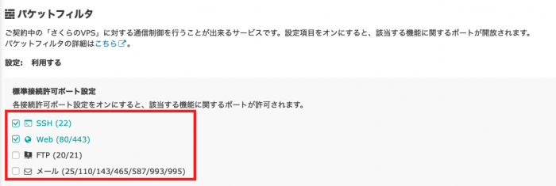
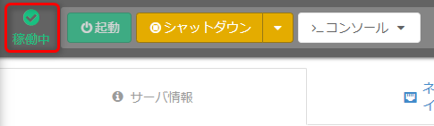
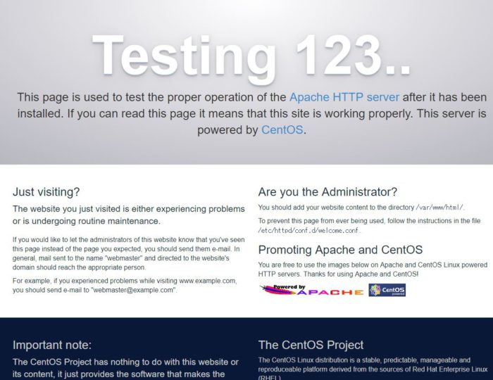
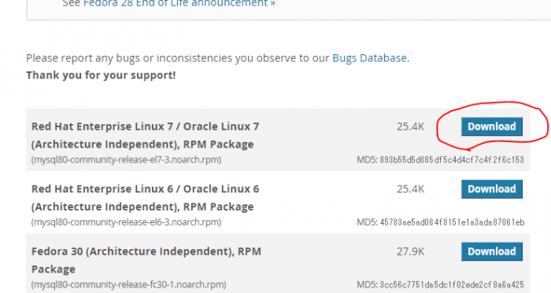
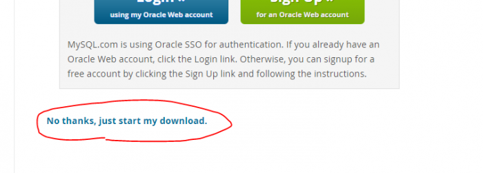
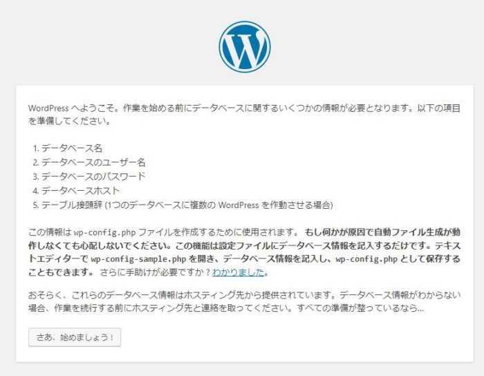

さくらVPSでLAMP環境構築手順の説明します。

LAMP環境構築ですが 、 プラスアルファとしてSSL化、 Git・phpMyAdmin・Wordpressのインストールもします。

各バージョンは以下のよう。

- **CentOS 7**
- **Apache 2.4**
- **MySQL 5.7**
- **PHP 7**

その他に入れるもの

- **SSL**
- **Git**
- **phpMyAdmin**
- **WordPress**

\[toc\]

## 事前にさくらのVPSを契約

当たり前ですが、事前にさくらのVPSを契約しておいてください。

契約後に登録したメルアドに送られてくる自動メールにログイン情報がありますので、それを使ってVPSにログインします。

ちなみに、さくらのVPSは最初の2週間無料でお試しできます。

## CentOS 7のインストール

まずは、OSのインストールから。

さくらのVPSの契約が終わったら、さっそく「VPSコントロールパネル」へログインしましょう。

コントロールパネルの右上の「各種設定」から「OSインストール」を選びます。



次に、OSのセレクトでは「CentOS7 x84\_64」を選んで、管理ユーザのパスワードを入力。



今回、パケットフィルタの設定は、SSH(22)とWeb(80/443)のポートを許可しておきます。



入力が終わったら、設定内容を確認するをクリック。

確認のポップアップがでるので、確認したら「インストールを実行する」をクリック。

そうすると、インストールがはじまるので終わるまで待ちます。

インストールが完了すると、コントールパネルに「稼働中」というサインがでます。



## ターミナルからサーバーへログイン

ターミナルを起動します。

今回、Windows10で、Git bashのターミナルを使っています。

以下のコマンドでサーバにログインします。

```
ssh root@xxx.xxx.xxx.xxx
```

※ xxx.xxx.xxx.xxx は、契約したIPアドレス

「Are you sure you want to continue connecting (yes/no)?」と聞かれるのyesを入力。そのあと、パスワードも聞かれるので、CentOS7をインストールしたときのパスワードを入力。

## ソフトフェアのアップデート

最新のソフトウェアを使用したいので、アップデートコマンドを入力。

```
yum -y update
```

途中、「Is this ok?」とでたらyを入力。

最後に「Complete!」とでたらアップデート完了

## 一般ユーザーの作成と設定

普段、rootでログインして作業するにはセキュリティ上よくないので、一般ユーザーを作成して、その一般ユーザでログインして作業を進めていきます。

好きな名前でいいので、一般ユーザーを作成

```
adduser user
```

一般ユーザーのパスワード設定。以下のコマンドを入力してパスワードを入力

```
passwd user
New password:
```

### 一般ユーザーでsudoを使えるようにする

wheelグループに追加することでsudoが使えるようになる。

以下のコマンドを入力

```
visudo
```

以下の箇所がコメントアウトされていないことを確認。

```
%wheel  ALL=(ALL)  ALL
```

#がついていた場合は、#を削除して保存

一般ユーザーをwheelグループに追加。

```
usermod -aG wheel user
```

追加されたか確認

```
groups user
user : user wheel
```

wheelグループに属するユーザーのみsuを実行できるようにするために設定する

以下の、設定ファイルを編集していく

```
vi /etc/pam.d/su
```

ファイル内の「**auth　required　pam\_wheel.so use\_uid**」からコメント(#)を外して保存。

これで、**wheelグループ以外のユーザーがsuコマンドを実行しても拒否される。**

### 一般ユーザーでログイン確認

ログアウトする。

```
exit
```

再度、一般ユーザーでログイン

```
ssh user@xxx.xxx.xxx.xxx
```

パスワードを聞かれたら、入力してログイン

先頭が一般ユーザーを示す「$」マークになっていることを確認

### 一般ユーザーからrootユーザーになるには

一般ユーザーあらrootユーザーになるには、以下を入力。

```
su -
```

rootユーザーのパスワード聞かれるので入力。

一般ユーザーに戻るときは「exit」で戻れる。

次で鍵をローカルで作成するため、exitでサーバーがログアウトしておく。

## SSH公開鍵認証の設定

パスワード認証はセキュリティ的に危険なので、公開鍵認証設定をするのが一般的。

### 鍵の作成

ターミナルから、以下コマンド鍵を作成。

```
ssh-keygen -t rsa -v
Generating public/private rsa key pair.
Enter file in which to save the key (C:\Users\wingm/.ssh/id_rsa):
```

デフォルトの名前で鍵作成するので、上記のようになったら、エンター。

以下のように、鍵にパスフレーズを設定するよう言われるが、

今回は無しにしたいので何も入力しないで、エンター、エンター。

```
Enter passphrase (empty for no passphrase):
Enter same passphrase again:
```

これで公開鍵と秘密鍵ができました。

作成された鍵の確認します。

```
ls ~/.ssh
id_rsa  id_rsa.pub
```

「id\_rsa」は秘密鍵。「id\_rsa.pub」は公開鍵。

### 公開鍵をサーバに転送

サーバに一般ユーザーでログイン

```
ssh user@xxx.xxx.xxx.xxx
```

公開鍵をいれるディレクトリを作成し、一般ユーザーだけが読み込み、書き込み、実行できるように権限を設定。

```
mkdir .ssh
chmod 700 .ssh
```

ログアウトする。

```
exit
```

以下コマンドで、公開鍵をサーバへ転送する。

```
scp ~/.ssh/id_rsa.pub user@xxx.xxx.xxx.xxx:~/.ssh/authorized_keys
```

### 鍵を使ってログインする

秘密鍵をつかってログインできるか確認します。

```
ssh -i ~/.ssh/id_rsa user@xxx.xxx.xxx.xxx
```

これで、鍵認証によるログイン設定ができました。

## SSHのセキュリティ設定

SSHのセキュリティ設定します。

今回行うのは以下

- ポート番号の変更
- パスワード認証の禁止
- 空白パスワードの禁止
- rootによるSSH接続禁止

### SSHの設定ファイルのバックアップ

設定ファイルのバックアップをとっておきます。

```
sudo cp /etc/ssh/sshd_config /etc/ssh/sshd_config.org
```

### 設定ファイルの編集

```
sudo vi /etc/ssh/sshd_config
```

以下の箇所を変更

```
//ポートの変更
#Port 22
↓
Port 45454

//空白パスワードの禁止
#PermitEmptyPasswords no
↓
PermitEmptyPasswords yes

//パスワード認証の禁止
PasswordAuthentication yes
↓
PasswordAuthentication no

//rootによるSSH接続禁止
#PermitRootLogin yes
↓
PermitRootLogin no
```

保存したら、構文が正しいか確認コマンド入力

```
sudo sshd -t
```

何もなければOK

設定を反映させるためsshdの再起動

```
 sudo systemctl restart sshd
```

### ファイアウォールの設定

ファイルのコピー

```
sudo cp /usr/lib/firewalld/services/ssh.xml /etc/firewalld/services/ssh-45454.xml
```

xmlファイルの編集。

```
sudo vi /etc/firewalld/services/ssh-45454.xml
```

以下の箇所を変更

```
  <port protocol="tcp" port="22"/>
↓
  <port protocol="tcp" port="45454"/>
```

ファイアウォールの設定を反映させる。

```
sudo firewall-cmd --reload
success

sudo firewall-cmd --permanent --add-service=ssh-45454
success

sudo firewall-cmd --reload
success
```

変更を確認。

```
sudo firewall-cmd --list-all
public (active)
  target: default
  icmp-block-inversion: no
  interfaces: eth0
  sources:
  services: dhcpv6-client http ssh https ssh-45454
  ports:
  protocols:
  masquerade: no
  forward-ports:
  source-ports:
  icmp-blocks:
  rich rules:
```

servicesに、ssh-45454に追加されているのを確認します。

### SSHの接続確認

SSHのセキュリティ設定が上手くいっているか、接続確認します。

**万が一、設定が間違えてログインできないというのを防ぐために、もう一つ別のターミナルで起動して接続確認を行います。**

sshコマンドでログイン接続します。

```
ssh -p 45454 -i ~/.ssh/id_rsa user@xxx.xxx.xxx.xxxx
```

ファイアウォールで22番ポート（ssh）接続の設定をはずすため、以下のコマンドを入力。

```
sudo firewall-cmd --permanent --remove-service=ssh

sudo firewall-cmd --reload
```

確認します。

```
sudo firewall-cmd --list-all
public (active)
  target: default
  icmp-block-inversion: no
  interfaces: eth0
  sources:
  services: dhcpv6-client http https ssh-45454
  ports:
  protocols:
  masquerade: no
  forward-ports:
  source-ports:
  icmp-blocks:
  rich rules:
```

servicesにsshが削除されていることを確認します。

最後に、ログアウトしてSSH接続ができることを確認します。

```
exit

ssh -p 45454 -i ~/.ssh/id_rsa user@xxx.xxx.xxx.xxx
```

ちなみに、秘密鍵名を「id\_rsa」にしている場合、以下のように鍵の指定コマンドを省略して接続することができる。

```
ssh -p 45454 user@xxx.xxx.xxx.xxx
```

これで、SSHのセキュリティ設定は一通り終わり。

## Apacheのインストール

Apacheのインストールをします。

```
sudo yum install httpd
```

Apacheの起動をします。

```
sudo systemctl start httpd
```

起動しているか確認します。

```
sudo systemctl status httpd
```

Active: active (running)となっていればOK。

### 80番ポートと443番ポートをあける

http接続に使う80番ポートと、https接続で使う443番ポートがファイアウォールで閉じられいるので、開ける設定をします。

```
sudo firewall-cmd --add-service=http --zone=public --permanent
sudo firewall-cmd --add-service=https --zone=public --permanent
```

firewalldを再起動します。

```
sudo systemctl restart firewalld.service
```

設定の確認をします。

```
sudo firewall-cmd --list-all
public (active)
  target: default
  icmp-block-inversion: no
  interfaces: eth0
  sources:
  services: dhcpv6-client ssh-45454 http https
  ports:
  protocols:
  masquerade: no
  forward-ports:
  source-ports:
  icmp-blocks:
  rich rules:
```

services:にhttpとhttps追加されていることを確認。

### ブラウザで確認

ブラウザで確認をするため、ブラウザを起動。

契約したIPアドレスをブラウザで表示確認。



Apacheのテストページが確認できればOK

### 自動起動設定

Apacheが自動起動になるよう設定。

```
sudo systemctl enable httpd
```

設定確認します。

```
sudo systemctl list-unit-files -t service | grep httpd
httpd.service                                 enabled
```

httpd.service　enabledと表示されればOK

### ドキュメントルートの権限の設定

/var/www/のhtmlディレクトリの中に、htmlファイルを置くことでWEBアプリを公開できます。

しかし、現在、権限がroot:rootになっているので所有権の設定を変更します。

まず、 htmlディレクトリを扱えるグループを新規作成します。

```
sudo groupadd webusers
```

このグループに一般ユーザの「user」も追加します。

```
sudo usermod -aG webusers user
```

所有権の設定を変更します。

```
sudo chown apache:webusers /var/www/html/
sudo chmod -R 775 /var/www/html/
```

設定を反映させるために、一度ログアウトしてから、ログインしてください。

### index.htmlの作成して「Hello World!」の表示

ドキュメントルートである/var/www/html/は、まだ空なのでhtmlファイルを作成します。

```
sudo vi /var/www/html/index.html
```

index.htmlを開いたら、以下のように記述

```
<html>
<body>
Hello World!
</body>
</html>
```

契約したIPアドレスをブラウザで表示確認します。

「Hello World!」と表示さればOK

「Forbidden You don't have permission to access」と出る場合は、SELinuxの無効化します。

一時的に無効化する場合は以下

```
setenforce 0
```

永続的に無効化する場合は以下

```
sudo vi /etc/selinux/config
#SELINUX=enforcing
SELINUX=disabled
```

## EPELリポジトリとremiリポジトリのインストール

EPELリポジトリとremiリポジトリがインストールされているか確認

```
yum repolist
```

### EPELリポジトリのインストール

```
sudo yum install epel-release
```

### remiリポジトリのインストール

remiレポジトリの公式サイトからURLを確認して、以下のコマンドを入力。

```
 sudo yum localinstall https://rpms.remirepo.net/enterprise/remi-release-7.rpm
```

完了したら、インストールされているリポジトリを確認します。

```
yum repolist
```

## PHPのインストール

インストールできるPHPのバージョンを確認する。

```
yum list available | grep php-
```

php-commonの箇所からバージョンを確認。

PHPをインストールします。

```
sudo yum --enablerepo=remi-php71 install php php-devel php-mysql php-gd php-mbstring
```

バージョンの確認。

```
php -v
```

Apacheの再起動

```
sudo systemctl restart httpd
```

### php.iniの設定

バックアップを取って、開く、

```
sudo cp /etc/php.ini /etc/php.ini.org
sudo vi /etc/php.ini
```

以下の箇所を変更

```
post_max_size = 8M
↓
post_max_size = 128M

upload_max_filesize = 2M
↓
upload_max_filesize = 128M
```

設定を反映をさせるため、Apacheの再起動

```
sudo systemctl restart httpd
```

### ブラウザでの確認

index.phpを作成する

```
sudo vi /var/www/html/index.php
```

index.phpを以下のように編集。

```
<?php
phpinfo();
```

契約したIPアドレスでindex.phpへブラウザアクセスする。

```
http://xxx.xxx.xxx.xxx/index.php
```

PHP の設定情報を出力されていればOK。

## MySQLのインストール

### MariaDBの削除

MariaDBがインストールされているか確認。

```
rpm -qa | grep maria
```

競合を避けるため、MariaDBの削除

```
sudo yum remove mariadb-libs
sudo rm -rf /var/lib/mysql
```

### MySQLインストール

MySQLにyumリポジトリをインストールします。

MySQLの公式サイトで最新リポジトリURLをコピーしてきます。

[公式サイト](https://dev.mysql.com/downloads/repo/yum/)で以下の「Download」ボタンクリック



次のページの下にある「」のリンクURLをコピーします。



今回の最新版は、「https://dev.mysql.com/get/mysql80-community-release-el7-3.noarch.rpm」だったので、以下のようにリポジトリをインストールします。

```
sudo rpm -Uvh https://dev.mysql.com/get/mysql80-community-release-el7-3.noarch.rpm
```

このままインストールすると、最新の8.0がインストールされます。

5.7のバージョンをインストールしたい場合は、以下のコマンドを入力。

```
sudo yum-config-manager --disable mysql80-community
sudo yum-config-manager --enable mysql57-community
```

インストールされるバージョンを確認。

```
sudo yum repolist enabled | grep mysql
```

MySQLインストールします。

```
sudo yum install mysql-community-server
```

バージョンの確認します。

```
mysqld --version
```

MySQLを起動します。

```
sudo systemctl start mysqld
```

### MySQLの設定

MySQLのrootのパスワードを確認します。

```
cat /var/log/mysqld.log | grep 'temporary password'
```

```
A temporary password is generated for root@localhost: xxxxxxxxxxx
```

xxxxxxxxxxxの部分がrootユーザの初期パスワードです。

あたらしくパスワードを設定します。

```
 mysql_secure_installation
```

初期パスワードを使って、新しいパスワードを新しく設定します。

MySQLにログインします。

```
mysql -u root -p
```

パスワードを聞かれたら、新しく設定したパスワードを入力してログイン。

データベースー覧の表示してみます。

```
mysql> show databases;
```

一旦、「exit」でログアウトします。

文字コードをUTF-8にしておきます。

```
sudo vi /etc/my.cnf
```

ファイルを開いたら、最後の行に以下内容を追記。

```
character-set-server=utf8
```

mysqldを再起動します。

```
sudo systemctl restart mysqld
```

### 自動起動の設定

OS起動時に自動起動するように設定しまうｓ。

```
sudo systemctl enable mysqld
```

設定の確認をします。

```
systemctl list-unit-files -t service | grep mysql
```

mysqld.service　enabledとなっていればOK。

**ここまでで、ひととおりLAMP環境構築は完了。**

## DNSの設定

各自、ドメイン取得サービスでドメインを購入などしておいてください。

ドメイン取得サービスの管理画面でDNSの設定を行ってください。

やり方は、 ドメイン取得サービスごとに異なるので割愛します。

## SSL化の設定

SSLは、Let's Encryptは使用します。

### バーチャルホストの設定

バーチャルホストの設定ファイルを作成します。

```
sudo vi /etc/httpd/conf.d/ドメイン名.conf
```

以下のように記述してください。

```
<Virtualhost *:80>
DocumentRoot /var/www/html
ServerName ドメイン名
</Virtualhost>
```

設定ファイルの構文が正しいかチェック

```
apachectl configtest
Syntax OK
```

Apacheの再起動

```
sudo systemctl restart httpd
```

### **certbot**のインストール

```
sudo yum install certbot-apache
```

### 証明書のインストール

```
sudo certbot --apache
```

メールアドレスを入力して、同意文書に(A)greeし、メールが送られていいかの有無を選択します。

ドメインの選択では、該当の番号入力してエンター。

リダイレクト（httpをhttpsへ）の設定に関しては、2番を選択。

### ブラウザで確認

ブラウザへhttpsでちゃんと表示できる確認。また、httpでアクセスしてhttpsへリダイレクトされるか確認します。

### SSLの更新

まずは、証明書の期限の確認。

```
sudo certbot certificates
```

Expiry date:のVALID: ●● daysの部分が残りの日数です。

証明書の期限が30日未満場合に更新をする場合は、以下のコマンドを入力

```
sudo certbot renew
```

もし、強制的に更新したい場合は以下のように入力

```
sudo certbo renew --force-renew
```

cronで自動更新する設定を行います。

```
sudo vi /etc/crontab
```

ファイルが開いたら以下のように記述します。今回は毎日午前3時にcertbotコマンドを実行するに設定します。

```
# Example of job definition:
# .---------------- minute (0 - 59)
# |  .------------- hour (0 - 23)
# |  |  .---------- day of month (1 - 31)
# |  |  |  .------- month (1 - 12) OR jan,feb,mar,apr ...
# |  |  |  |  .---- day of week (0 - 6) (Sunday=0 or 7) OR sun,mon,tue,wed,thu,fri,sat# |  |  |  |  |
# *  *  *  *  * user-name  command to be executed
0 3 *  *  * root /usr/bin/certbot renew
```

## phpMyAdminのインストール

phpMyAdminをインストールします。

remiリポジトリにしかないphp7.1系のパッケージをあわせてインストールをするため、以下のコマンドを入力します。

```
sudo yum -y install --enablerepo=remi,remi-php71 phpMyAdmin
```

### 設定ファイルの編集

バックアップをとって編集する。

```
cp /etc/httpd/conf.d/phpMyAdmin.conf /etc/httpd/conf.d/phpMyAdmin.conf.org
```

```
sudo vi /etc/httpd/conf.d/phpMyAdmin.conf
```

「/usr/share/phpMyAdmin/」ディレクティブを変更

まず、どこからでもアクセスできるようにします。

```
<Directory /usr/share/phpMyAdmin/>
   AddDefaultCharset UTF-8

   <IfModule mod_authz_core.c>
     # Apache 2.4
     Require local
↓
<Directory /usr/share/phpMyAdmin/>
   AddDefaultCharset UTF-8

   <IfModule mod_authz_core.c>
     # Apache 2.4
     Require all granted
```

また、SSL通信のみ許可できるように設定します。

```
<Directory /usr/share/phpMyAdmin/>
   AddDefaultCharset UTF-8

   <IfModule mod_authz_core.c>
↓
<Directory /usr/share/phpMyAdmin/>
   AddDefaultCharset UTF-8
   SSLRequireSSL
   <IfModule mod_authz_core.c>
```

ApacheがSSLを使用できるように、モジュールがインストールされていいなければインストールします。

以下コマンドでインストールの確認。

```
sudo httpd -M | grep ssl_module
```

インストールしていなければ、以下でインストールします。

```
yum install mod_ssl
```

Apacheの再起動

```
sudo systemctl restart httpd
```

### ブラウザでアクセス

契約したIPアドレスの「/phpMyAdmin/」にアクセスする。

```
http://xxx.xxx.xxx.xxx/phpMyAdmin/
```

phpMyAdminのログイン画面が表示されればOK。

## WordPressのインストール

WordPressをインストールしていきます。

まず、WordPress用のデータベースを作成していきます。

### DBの作成

MySQLにログインします

```
mysql -u root -p
```

データベースを作成

```
create database wp;
```

### MySQLユーザの作成

```
create user 'wp_user'@'localhost' identified with mysql_native_password by 'password';
```

'wp\_user'と'password'は、各自好きなように設定。

作成したユーザーが、先ほど作成した「wp」データべースを扱えるようにします。

```
grant all privileges on wp.* to 'wp_user'@'localhost';
```

設定の反映を行います。

```
flush privileges;
```

確認して、ログアウト。

```
show databases;

exit
```

### WordPressをダウンロード

wgetがインストールされているか確認。

```
yum list installed | grep wget
```

インストールされていなければ、以下でインスール。

```
sudo yum install wget
```

WordPressの公式サイトで、.tar.gz形式のURLをコピーしてくる。

tmpディレクトリへダウンロードします。

```
cd /tmp
wget https://ja.wordpress.org/latest-ja.tar.gz
```

展開して、ドキュメントルートに移動する。

```
sudo tar -zxvf latest-ja.tar.gz -C /var/www/
```

権限の変更をします。

```
sudo chown -R apache:webusers /var/www/wordpress
```

### ドキュメントルートの変更

ドキュメントルートを変更します。

```
sudo vi /etc/httpd/conf/httpd.conf
```

以下の箇所を変更します。

```
DocumentRoot "/var/www/html"
↓
DocumentRoot "/var/www/wordpress"

<Directory "/var/www/">
↓
<Directory "/var/www/wordpress">
```

### バーチャルホストの方もドキュメントルートを修正

80番ポートの方の設定をします。

```
sudo vi /etc/httpd/conf.d/ドメイン名.conf
```

以下のように編集

```
DocumentRoot /var/www/html
↓
DocumentRoot /var/www/wordpress
```

同様に443番ポートの方の設定をします。

```
sudo vi /etc/httpd/conf.d/ドメイン名-le-ssl.conf
```

以下のように編集

```
DocumentRoot /var/www/html
↓
DocumentRoot /var/www/wordpress
```

Apacheの設定ファイルの構文が正しいかチェック

```
sudo apachectl configtest
Syntax OK
```

Apacheの再起動

```
sudo systemctl restart httpd
```

### ブラウザで確認

契約したIPアドレスにアクセスする。

```
http://xxx.xxx.xxx.xxx/
```



WordPressの設定画面が表示されればOK。

「さぁ、始めましょう！」のボタンクリックして、各種設定したデーターベース情報を入力すればWordPressを使用できるようになります。
