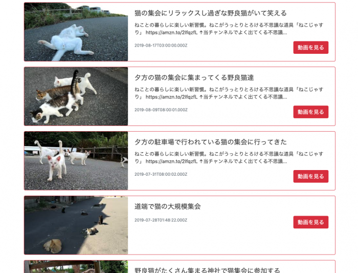

YouTubeで検索ワードの結果を取得して、Vue.jsで自分のサイトに表示させる方法を説明する。

今回は、**「猫　集会」**というキーワード行う。

# API キーを取得

APIキーの取得には、Googleアカウントが必要。

[Google Developers Console](https://console.developers.google.com/?hl=ja)でAPIキーを取得する。

# Vueでコード書いていく

APIを叩くURLは以下のよう。

```
https://www.googleapis.com/youtube/v3/search?type=video&part=snippet&q=猫　集会&key={APIキーを入れる}
```

「猫　集会」の検索結果を一覧表示させる実際のコードは以下。

まずは、HTML。

## HTML

```
<div id="app" class="content">
    <h1 class="h1 mb-4 pl-3 py-2">猫の集会動画</h1>
    <div v-for="i in info">
        <div v-for="item in i.items" class="card mb-3 border-danger">
            <div class="row no-gutters">
                <div class="col-md-4">
                    <a :href="'https://www.youtube.com/watch?v='+ item.id.videoId">
                        
                    </a>
                </div>
                <div class="col-md-8">
                    <div class="card-body">
                        <h5 class="card-title">{{item.snippet.title}}</h5>
                        <p class="card-text">{{item.snippet.description}}</p>
                        <div class="d-flex justify-content-between">
                        <p class="card-text"><small class="text-muted">{{item.snippet.publishedAt}}</small>
                        </p>
                        <a :href="'https://www.youtube.com/watch?v='+ item.id.videoId" class="btn btn-danger">動画を見る</a>
                        </div>
                    </div>
                </div>
            </div>
        </div>
    </div>
    <ul class="d-flex justify-content-between mt-5">
        <li class="btn btn-danger rounded-pill" v-on:click="nextpage(info.data.prevPageToken)">前へ</li>
        <li class="btn btn-danger rounded-pill" v-on:click="nextpage(info.data.nextPageToken)">次へ</li>
    </ul>
</div>
```

表示数はデフォルトでは５個の動画。

これだと検索結果のすべての動画を閲覧することができないため、ページ送り（前へ・次へ）を実装している。

まず、最初の一覧を取得するためのAPIを叩くと、5つの動画を取得できる。

同時に、PrevPageTokeとnextPageTokenというプロパティも取得できる。これは他のページを表示させるためのパラメータとなる。

これをVue.js側に渡してあげて、再度APIのURLを生成しリンクを設置。

Vue.jsでの処理は以下。

## JavaScript(Vue.js)

```
   <script>
        new Vue({
            el: '#app',
            data() {
                return {
                    info: null,
                    api:'https://www.googleapis.com/youtube/v3/search',
                    params:{
                        type: 'video',
                        part: 'snippet',
                        q: '猫　集会',
                        order: 'date',
                        pageToken:'',
                        key: '{APIキーを入れる}'
                    }
                }
            },
            created(){
                const params = this.params
                axios.get(this.api, { params })
                .then(response => {
                    this.info = response
                })
            },
            methods:{
                nextpage:function(token){
                    this.params.pageToken = token
                    const params = this.params
                    axios.get(this.api, { params })
                    .then(response => {
                        this.info = response
                    })
                }
            }
        })
    </script>
```

これを、ブラウザで確認する

# ブラウザで動作確認



ちゃんと表示されたらOK。
