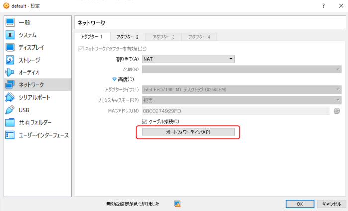
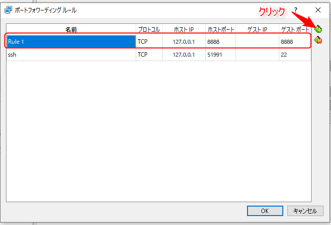

Windows10 Pro（64bit）以外のWindows（Windows10 Homeなど）でDockerを使う場合Docker Toolboxを使うこととなる。

しかし、他のDockerとは違いコンテナ起動後にでhttp://localhostへアクセスしてもアクセスはできない。

とりあえず、アクセスする方法として`docker-machine ip`コマンドを使って仮想マシンを動かしているVirtualBoxのIPアドレスを調べて、そのIPアドレスでする。

```
$ docker-machine ip
192.168.99.100
```

なぜこうなるかというと、docker-compose.ymlで設定したポートフォワーディング（8888:80）は、『Windows（8888） → Docker（80）』ではなく、『VirtualBox（8888） → Docker（80）』となるから。

**localhostでアクセスするには、『Windows（8888）→VirtualBox（8888） → Docker（80） 』という感じで設定する必要がある。**

## localhostでアクセスできるようにポートフォワーディングの設定

localhostでアクセスするようにVirtualBoxのポートフォワーディングの設定を行う。

VirtualBoxの「設定」を開き、「ネットワーク→高度→ポートフォワーディング」を進む。



ポートフォワーディング ルールでプラスボタンをクリックし「ホストIP」を「127.0.0.1」、「ホストポート」を「8888」、「ゲストポート」を「8888」としてルールを追加する。



これでlocalhostで起動したコンテナにアクセスることができる。

キャッシュが残って反映されない場合があるので、その場合は、キャッシュを一旦消す。
