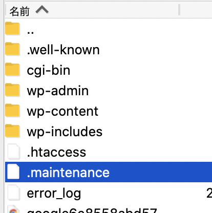

WordPressのプラグインを更新中に、ブラウザ更新ボタンを押してしまい、

WordPressのサイトが**「現在メンテナンス中のため、しばらくの間ご利用いただけません。」**としか表示されなくなってしまった。

## 解決方法

解決方法としては、サーバにある**「.maintenance」を削除**するだけ。

## 「.maintenance」のある場所

WordPressを設置しているサーバへFTPツールで接続し、WordPressファイル群がある公開ディレクトリ直下に移動。

そこに「.maintenance」がある。

