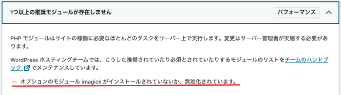

WordPressサイトヘルスチェックの「1つ以上の推奨モジュールが存在しません」の中で、**「オプションのモジュール imagick がインストールされていないか、無効化されています。」**と出たのでimagickモジュールを入れることにした。



環境は以下

- さくらのVPS
- CentOS 7
- Nginx 1.17
- PHP 7.4
- MariaDB

※**VPSでなくレンタルサーバーサービスならコントールパネルといった管理画面から簡単に入れられると思う。**

perlコマンドを使えるようにするため、php-pear php-develをインストール。

```
yum install --enablerepo=remi,remi-php74 php-pear php-devel
```

次に、imagickをインストール

```
pecl install imagick
```

/etc/php.d/の下に30-imagick.iniというiniファイルを作成し編集していく。

```
vi /etc/php.d/30-imagick.ini
```

そして、ファイルへ以下の記述をする。

```
; Enable imagick extension module
extension=imagick.so
```

最後に、php-fpmを再起動。

```
systemctl restart php-fpm
```

WordPressの管理画面に戻って、テスト通過されていることが確認できればOK。


