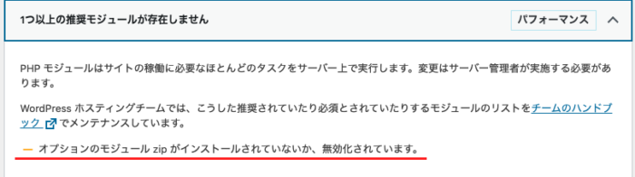
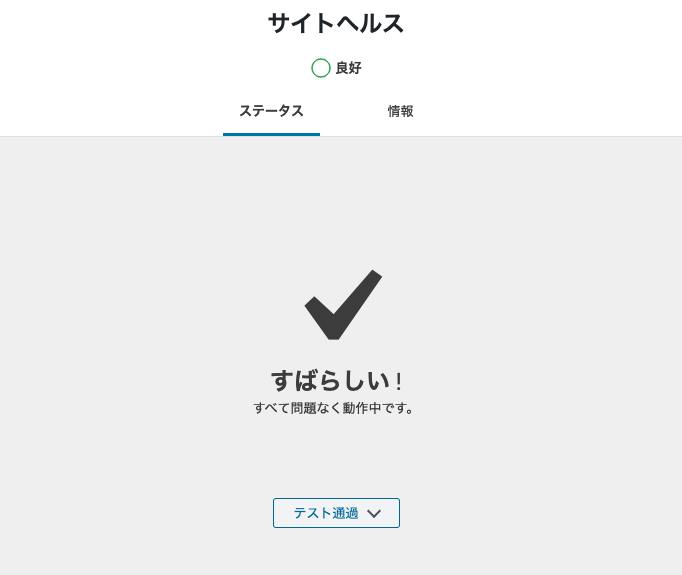

WordPressサイトヘルスチェックの「1つ以上の推奨モジュールが存在しません」の中で、**「オプションのモジュール zip がインストールされていないか、無効化されています。」**と出たのでzipモジュールを入れることにした。



環境は以下

- さくらのVPS
- CentOS 7
- Nginx 1.17
- PHP 7.4
- MariaDB

※**VPSでなくレンタルサーバーサービスならコントールパネルといった管理画面から簡単に入れられると思う。**

zipモジュールは、`php-pecl-zip`を入れればよい。

```
yum --enablerepo=remi,remi-php74 install php-pecl-zip
```

最後に、php-fpmを再起動。

```
systemctl restart php-fpm
```

WordPressの管理画面に戻って、テスト通過されていることが確認できればOK。


