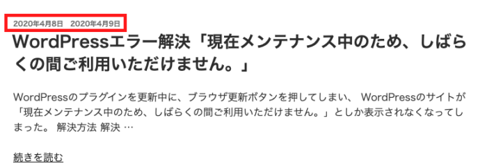
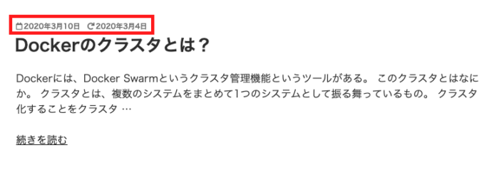
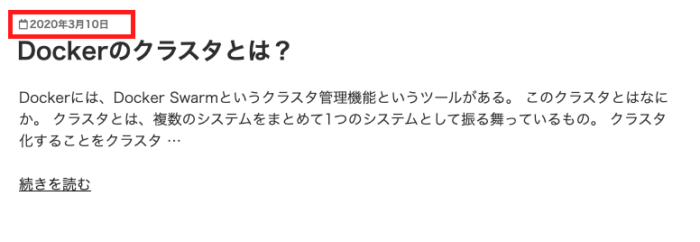
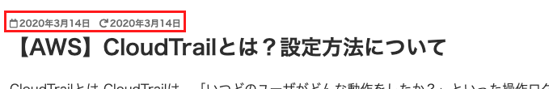

WordPressの公式テーマである「Twenty Seventeen」は初期状態でブログ記事の最新更新日が表示されていない。

## 最終更新日を表示には？

**最終更新日を表示させるには、CSSを編集するだけ。**

そもそも最終更新日は画面上に出力されているのだが、CSSの`display: none`で非表示にされている。

以下のCSSを追加すればよい。

### style.css

```
time.updated:not(.published) {
    display: inline;
    margin-left: 1em;
}
```

**※CSSを追加するなどWordPressテーマのカスタマイズをする場合は、子テーマを作成してファイルの上書きをすることをオススメする。そうしないと、WordPressテーマを更新するとカスタマイズした内容がすべてふっとんでしまう。**

そうすると投稿日の右に最終更新日が表示される。



## 予約投稿すると投稿日より更新日が昔になってしまう問題

とりあえず最終更新日を表示することはできた。

しかし、予約投稿した場合、投稿日は予約投稿日に設定した日になるが更新日は記事を作成した日になるため、**投稿日より更新日が昔になってしまう、なんとも気持ち悪いことになる。**



これを解決するには、WordPressテーマフォルダにある**「template-tags.php」**を編集する必要がある。

template-tags.phpを開いて、`function twentyseventeen_time_link()`内を変更していく。

template-tags.phpの変更を子テーマ側でしたい場合は、style.cssで変更する場合とやり方少し異なるので以下の記事を参照。

https://blog.pop-web.net/programming/child-theme-directory-overwrite/

### template-tags.php

```
if ( get_the_time( 'U' ) !== get_the_modified_time( 'U' ) ) {
```

の部分を

```
if ( get_the_time( 'U' ) < get_the_modified_time( 'U' ) ) {
```

とする。

これで更新日が投稿日より昔の場合には表示されないようになる。



また、初投稿した記事の場合、投稿日と更新日が同じ日として表示される。



記事を更新していないのに、更新日として表示されるのが嫌だって場合は、先ほど修正した`template-tags.php`の内容を以下のようにif文の`if(get_the_date() == get_the_modified_date())`を追加する。

```
    if ( get_the_time( 'U' ) < get_the_modified_time( 'U' ) ) {
        $time_string = '<time class="entry-date published" datetime="%1$s">%2$s</time><time class="updated" datetime="%3$s">%4$s</time>';
        if(get_the_date() == get_the_modified_date()){
          $time_string = '<time class="entry-date published updated" datetime="%1$s">%2$s</time>';
        }
    }
```

つまり、日付が同じ場合は投稿日だけ表示させるロジックをさらに追加しているのだ。

これで、投稿日と更新日が同じ日の場合には更新日が表示されなくなる。
