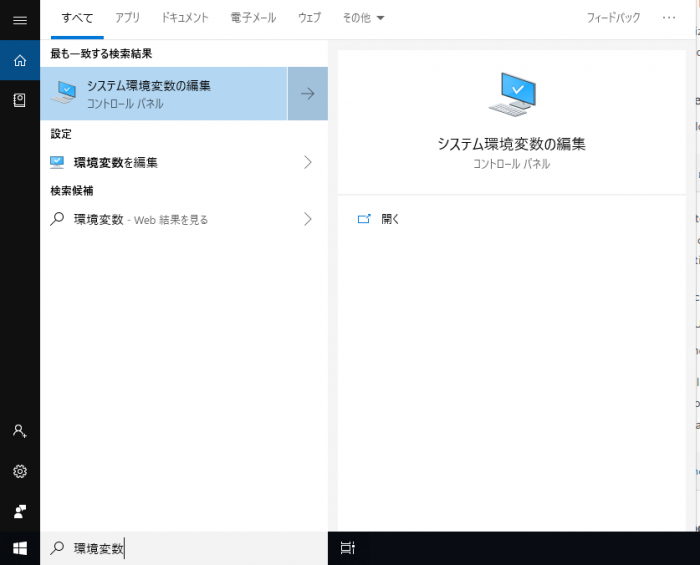

XAMPPをインストールして、さぁMySQLコマンドを使って、MySQLにログインしようと

```
>mysql -u root
'mysql' は、内部コマンドまたは外部コマンド、
操作可能なプログラムまたはバッチ ファイルとして認識されていません。
```

MySQLコマンドが使えないとでるので、使えるようにする手順を書きます。

## 環境変数のPathに追加する

MySQLコマンドを使えるようにするには、環境に変数にPathを追加するだけ。

追加する場所は、Windowsの検索窓の「環境変数」と入力します。

「システム環境変数の編集」がヒットするのでそれを選択し、さらに現れたウィンドウの中の「環境変数」をクリックします。



表示された環境変数のウィンドウのリストから「Path」を選択して「編集」ボタンをクリックして編集していきます。

そして、以下のパスを追加します。

```
C:\xampp\mysql\bin
```

## コマンドの実行

```
>mysql -u root
Welcome to the MariaDB monitor.  Commands end with ; or \g.
Your MariaDB connection id is 5638
Server version: 10.1.35-MariaDB mariadb.org binary distribution

Copyright (c) 2000, 2018, Oracle, MariaDB Corporation Ab and others.

Type 'help;' or '\h' for help. Type '\c' to clear the current input statement.

MariaDB [(none)]>
```

こんな感じに実行されれば完了です。
